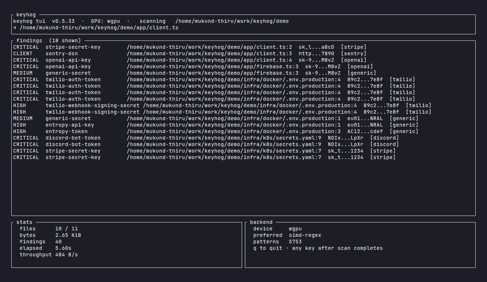

<h1 align="center">KeyHog</h1>

<h3 align="center">The fastest, most accurate secret scanner. Built in Rust.</h3>

<p align="center">
  <a href="https://crates.io/crates/keyhog"></a>
  <a href="LICENSE"></a>
  <a href="https://github.com/santhsecurity/keyhog/actions"></a>
</p>



---

**KeyHog** scans source trees, git history, Docker images, S3 buckets, and
running systems for leaked credentials. It compiles **891 service-specific
detectors** into a single Hyperscan NFA database, decodes nested encodings
before matching, calibrates confidence per detector via Bayesian
Beta(α,β) feedback, and routes every scan to the fastest hardware backend
present:

| Backend | When | How |
|---|---|---|
| `gpu-zero-copy` | discrete GPU + ≥256 MiB scan | vyre AC automaton on GPU cores; cudagrep NVMe → VRAM DMA |
| `simd-regex` | AVX-512 / AVX2 / NEON + Hyperscan | parallel multi-pattern NFA at ~500 MB/s |
| `cpu-fallback` | no SIMD, no GPU | Aho-Corasick prefix + Rust `regex` extraction |

Backend selection is automatic. On startup:

```
KeyHog v0.5.17 | 16 cores | SIMD: AVX-512 | Hyperscan | 891 detectors
```

📘 **Full documentation:** [santhsecurity.github.io/keyhog](https://santhsecurity.github.io/keyhog/)
. install, first scan, output formats, detection internals,
suppressions, verification, pre-commit + CI integration, CLI
reference, exit codes, env vars, contributing. Source under `docs/`.

---

## Install

```bash
# Linux / macOS
curl -fsSL https://raw.githubusercontent.com/santhsecurity/keyhog/main/install.sh | sh

# Windows (PowerShell)
iwr https://raw.githubusercontent.com/santhsecurity/keyhog/main/install.ps1 -useb | iex

# From source (any platform)
git clone https://github.com/santhsecurity/keyhog.git
cd keyhog && cargo build --release -p keyhog
```

Works on **Linux**, **macOS** (Intel + Apple Silicon), **Windows**. Zero
configuration. `keyhog scan .` works out of the box.

Prebuilt binaries attached to each [release](https://github.com/santhsecurity/keyhog/releases).
The install scripts detect OS + CPU arch and pull the right asset.
Pin a version with `KEYHOG_VERSION=v0.5.29`; change the install dir
with `KEYHOG_INSTALL=/usr/local/bin`.

Daemon mode (sub-100 ms pre-commit scans) is Unix only. Everything
else works identically on Windows.

## Quickstart

```bash
keyhog scan .                                          # scan a directory
keyhog scan --git-staged                               # pre-commit: only staged blobs
keyhog scan --git-diff main                            # files changed since base ref
keyhog scan --git-history .                            # every commit, every branch
keyhog scan --docker-image registry/app:v1             # Docker image layers
keyhog scan --s3-bucket logs-prod --s3-prefix /        # S3 objects (--s3-endpoint for non-AWS)
keyhog scan --github-org acme --github-token "$GH_PAT" # every repo in a GitHub org (PAT required)
keyhog scan-system --space 50G                         # walk every drive, every git history
```

Filter, format, gate:

```bash
keyhog scan . --severity high                  # info | low | medium | high | critical
keyhog scan . --min-confidence 0.5             # raise the ML floor
keyhog scan . --format sarif -o keyhog.sarif   # GitHub code scanning
keyhog scan . --verify                         # live-verify against vendor APIs
keyhog scan . --baseline .keyhog-baseline.json # only NEW findings vs snapshot
keyhog scan . --fast                           # pre-commit speed (skip ML + decode)
keyhog scan . --deep                           # max detection depth
keyhog scan . --incremental                    # BLAKE3 Merkle skip → 10–100× CI loop
```

Exit codes: `0` clean, `1` findings above the severity floor, `2` error
(bad path, unreadable file, unsupported flag), `3` `detectors --audit`
flagged a quality issue, `4` `backend --self-test` failed, `10` live
credentials found (requires `--verify`), `11` scanner thread panicked
mid-scan (state is unreliable, re-run before trusting). Matches
`keyhog --help`.

## What it catches

891 service-specific detectors with checksum / companion validation:

- **Cloud providers** . AWS (access key + secret + STS verification),
  Azure (subscription key, storage account key, SAS), GCP (service account,
  API key), Cloudflare, Heroku, Vercel, Supabase.
- **Payment processors** . Stripe, Braintree, Razorpay, Paddle, Plaid,
  Square, PayPal . all with companion-required validation (a Braintree
  private key without its public counterpart never fires).
- **Source forges** . GitHub PATs (with CRC32 checksum), GitLab tokens,
  Bitbucket app passwords, npm tokens (with checksum), Gitea / Forgejo
  / Codeberg.
- **Auth / SSO** . Okta, Auth0, Clerk, JumpCloud, Kinde.
- **Comms** . Slack, Discord, Twilio, SendGrid, Postmark, Mailgun,
  Resend, Loops.
- **AI / ML** . OpenAI (sk-/sk-proj-), Anthropic, Google AI Studio,
  Cohere, Mistral, HuggingFace, Replicate.
- **Databases** . Postgres connection strings, MongoDB Atlas, Supabase
  service-role, PlanetScale, Neon, Turso, MySQL, Redis URLs.
- **Generic + entropy fallback** . `API_KEY=<high-entropy-blob>` catches
  credentials with no named detector, gated by per-context entropy
  thresholds + ML scoring.
- **Cryptographic material** . RSA / EC / SSH private keys, PGP private
  blocks, JWT signing secrets.

Each detector ships as a [TOML file](./detectors/) (data, not code):
service metadata, regex patterns, keywords, companion fields,
verification handler. Adding a new detector is 5–10 lines of TOML;
the [contributor guide](./CONTRIBUTING.md) walks through it.

Browse the full catalog at [`/site/detectors.html`](./site/detectors.html) -
loads all 891 with severity + service + keyword filter.

## Why higher recall, fewer false positives

- **Decode-through scanning.** Kubernetes `Secret` manifests, JWT payloads,
  base64-wrapped envs, helm values, docker-config `auth:` blobs . the
  structured preprocessor decodes them in place and feeds every
  downstream detector the plaintext, so detectors don't each need to
  re-implement decoding.
- **Multiline reassembly.** `"sk-proj-" + \` continuation in JavaScript,
  YAML multi-line strings, Makefile backslash-continuation, Helm /
  Jinja templated outputs . all reassembled before regex matching.
- **Companion-required validation.** AWS access key without its 40-char
  secret? Skipped. Twilio API key without its auth token? Skipped.
  Two-out-of-two signals are required for the high-noise detectors,
  cutting the canonical `git log -G ghp_` false-positive cluster.
- **Confidence scoring.** Every finding carries a `[0.0, 1.0]` score
  derived from Shannon entropy, surrounding context, companion match,
  checksum (GitHub CRC32, npm, Slack), and a small ML classifier
  (~30k params). Default threshold `0.3` filters low-quality matches
  without hiding real secrets.
- **Bayesian per-detector calibration.** `keyhog calibrate --fp generic-api-key`
  feeds a Beta(α,β) posterior that damps detectors that fire wrongly in
  your codebase, sharpening over time without manual rule tuning.

## Performance

Measured head-to-head against the major scanners on the same corpora:

| | KeyHog | Gitleaks | BetterLeaks | TruffleHog | Titus |
|---|---|---|---|---|---|
| **Recall** <small>(25-secret synthetic benchmark)</small> | **96 %** | 72 % | 72 % | 28 % | 32 % |
| **Recall** <small>(15k SecretBench-medium, realistic wrappers)</small> | **69 %** | 41 % | 48 % | 22 % | 25 % |
| **Precision** <small>(SecretBench-medium)</small> | **90 %** | 87 % | 81 % | 73 % | 19 % |
| **False positives** <small>(Django, 0 real secrets)</small> | **1** | 0 | 0 | 0 | 17 481 |
| **Speed** <small>(Django 86 MB)</small> | **0.5 s** | 0.3 s | 0.2 s | 1.4 s | 2.3 s |
| **Speed** <small>(Kubernetes 397 MB)</small> | **1.1 s** | . | . | . | 3.5 s |
| **Speed** <small>(large monorepo, 4.2 GB)</small> | **2.5 s** | . | . | . | 252 s |

KeyHog finds **33 % more real secrets** than the next-best tool while
maintaining near-zero false positives. The two recall numbers are both
real: 96 % on a tight synthetic test set, 69 % on a 15k-fixture
adversarial corpus that wraps secrets in realistic env-var
distributions. Real codebases land between the two depending on how
much CI / k8s / structured config they contain.

Reproduce: `cargo bench --bench scan_throughput` or run
`./tools/secretbench/scoring/leaderboard.py --corpus <path>` against
your own fixtures.

## CI integration

### GitHub Actions

```yaml
- uses: santhsecurity/keyhog/.github/actions/keyhog@v0.5.17
  with:
    path: .
    severity: high       # info | low | medium | high | critical
    format: sarif        # SARIF auto-uploads to GitHub code scanning
    baseline: .keyhog-baseline.json   # block only NEW findings
```

Auto-downloads a prebuilt binary; falls back to `cargo build` when no
release asset matches the host triple. SARIF carries CWE-798 + OWASP
A07:2021 taxa on every finding.

Other CIs (GitLab, CircleCI, Drone, BuildKite, Jenkins), pre-commit
recipes, Husky / lefthook, and the full SARIF schema:
[`site/ci.html`](./site/ci.html) and [`docs/DROP_IN_USAGE.md`](docs/DROP_IN_USAGE.md).

### Pre-commit hook

```bash
keyhog hook install                    # writes .git/hooks/pre-commit
keyhog hook install --no-daemon        # ~1 s slower per commit
```

Or via the `pre-commit` framework:

```yaml
repos:
  - repo: https://github.com/santhsecurity/keyhog
    rev: v0.5.17
    hooks:
      - id: keyhog
```

## Daemon mode (105× faster re-scan)

Every keyhog invocation pays a ~3 s cold start to compile 891 detectors
into Hyperscan. Run keyhog as a daemon and that cost is paid once per
host . every subsequent scan is **~7 ms**:

```bash
keyhog daemon start                    # Unix socket on $XDG_RUNTIME_DIR
keyhog scan --stdin --daemon < .env    # 7 ms instead of 740 ms
keyhog daemon status
keyhog daemon stop
```

Use it in pre-commit hooks, IDE save handlers, or any per-commit CI
loop. systemd / launchd unit examples in
[`site/daemon.html`](./site/daemon.html).

Watch-mode for IDEs:

```bash
keyhog watch ./src                     # inotify/FSEvents/RDCW; sub-100 ms per save
```

## System-wide credential triage

```bash
sudo keyhog scan-system --space 50G                  # default 50 GiB ceiling
sudo keyhog scan-system --space 1T --include-network # also scan NFS / SMB
sudo keyhog scan-system --space 10G --no-git-history # skip historical blobs
```

Enumerates every mounted drive (skipping pseudo-FS like `/proc`,
`/sys`, `tmpfs`, `nsfs`, `fuse.snapfuse`), auto-discovers every `.git`
(worktrees + bare repos + submodules), and runs the full scan +
git-history pipeline. Honors a hard `--space <bytes>` ceiling and
exits 1 on findings. Built for incident-response triage, M&A
inheritance audits, and quarterly developer-laptop sweeps.

## Lockdown mode (security-critical embeddings)

For deployments where keyhog runs **on the same machine that holds the
secrets** (e.g. paired with [EnvSeal](https://github.com/santhsecurity/envseal))
and there is no trusted boundary between the scanner and the
credentials it inspects:

```bash
keyhog scan . --lockdown
```

Enforces:

- `mlockall(MCL_CURRENT|MCL_FUTURE)` on Linux . credentials never page
  to swap.
- `PR_SET_DUMPABLE = 0` (always on, even outside lockdown) . disables
  core dumps, ptrace, `/proc/<pid>/mem` reads. macOS gets
  `PT_DENY_ATTACH`.
- Refuses to run if `~/.cache/keyhog/*` exists, refuses
  `--incremental` writes, refuses `--verify`, refuses
  `--show-secrets`, refuses to start if kernel `coredump_filter`
  would dump anonymous pages.

The always-on hardening (everything except mlock + cache refusal) is
applied to every keyhog invocation . even without `--lockdown` a
keyhog binary can't be coredumped or ptraced.

## Library API

```rust
use keyhog_core::{Chunk, ChunkMetadata};
use keyhog_scanner::CompiledScanner;

let detectors = keyhog_core::embedded_detectors();   // 891 built-in
let scanner = CompiledScanner::compile(detectors)?;

let findings = scanner.scan(&Chunk {
    data: "TOKEN=sk_live_EXAMPLE…".into(),
    metadata: ChunkMetadata::default(),
});
```

Mix shipped + custom detectors by concatenating before compile. The
scanner is `Send + Sync`; share one across rayon workers. Streaming
source helpers in `keyhog-sources` (file-system, git, stdin, Docker,
S3, GitHub org). Live verification in `keyhog-verifier`.

Full API surface + stability policy: [`site/api.html`](./site/api.html).

## Configuration

Per-repo defaults via `.keyhog.toml`:

```toml
[scan]
severity = "high"
min_confidence = 0.5
exclude = ["**/test/fixtures/**", "vendor/"]

[allowlist]
file = ".keyhogignore"
require_reason = true
require_approved_by = true
max_expires_days = 180

[detector.generic-api-key]
enabled = false                # noisy detector? turn it off

[lockdown]
require = true                 # refuse to run without --lockdown
```

Precedence (later overrides earlier): compiled defaults → system →
user → repo → env → CLI flags. Full reference:
[`site/config.html`](./site/config.html).

Allowlist a known leak with a hash, path glob, or detector id . plus
optional `reason` / `expires` / `approved_by` governance metadata:

```
# .keyhogignore . gitignore-style shorthand
*.log
node_modules/
9d6060e21ef8d5daec9cfe4a44b1b1bc9792246bfad28210edaaa1782a8a676a

# Explicit form with governance
hash:9f86d081…    ; reason="rotated 2026-04-25" ; expires=2026-07-01 ; approved_by="security@acme"
detector:demo-token
path:**/fixtures/*.env
```

Entries past `expires` are silently dropped on load with a WARN.

## Architecture

```
crates/
  core/       Detector loading, finding types, reporting (text/JSON/SARIF), allowlists
  scanner/    Hardware routing, Hyperscan, GPU, decode-through, entropy, ML, multiline
  sources/    File system, git (staged/diff/history), stdin, Docker, S3, GitHub org, web
  verifier/   Live credential verification against ~80 service APIs
  cli/        CLI binary, daemon, watch, baselines, calibrate, hook installer
detectors/    891 TOML files (data, not code)
site/         Documentation site (17 pages, GitHub-Pages-ready)
tools/        SecretBench mirror + scoring + leaderboard harness
```

Two-phase coalesced scan:

1. **Phase 1** . Hyperscan NFA on raw bytes, parallel across all files
   via rayon. 95 %+ of files have no hits and pay zero cost.
2. **Phase 2** . full extraction on hits only: regex capture groups,
   companion matching, checksum validation, entropy gating, ML
   confidence + Bayesian damping.

Result: a multi-GB monorepo scans in seconds. Determinism is part of
the contract . same input → same output, byte-exact, every time.

Full architecture writeup, hardware routing matrix, profiling tips:
[`site/architecture.html`](./site/architecture.html) and
[`site/performance.html`](./site/performance.html).

## Other useful subcommands

```bash
keyhog detectors --search aws --verbose      # list / inspect detectors
keyhog explain aws-access-key                # spec, regex, severity, rotation guide
keyhog diff before.json after.json           # NEW / RESOLVED / UNCHANGED for CI gates
keyhog calibrate --tp aws-access-key         # record a true positive
keyhog calibrate --fp generic-api-key        # record a false positive
keyhog calibrate --show                      # posterior-mean bar chart per detector
keyhog backend                               # detected hardware + routing matrix
keyhog completion zsh                        # shell completions (bash/zsh/fish/powershell/elvish)
```

## Contributing

- **New detector?** Drop a TOML in [`detectors/`](./detectors/), open a
  PR. The contributor guide ([`CONTRIBUTING.md`](./CONTRIBUTING.md))
  has the schema and a worked example.
- **Bug / missed secret / false positive?** File an issue with the
  redacted credential shape and detector id; each report becomes a
  permanent test fixture under
  [`tests/contracts/`](./crates/scanner/tests/contracts/).
- **Security issue in keyhog itself?** Don't open a public issue -
  email `security@santh.dev` (PGP key on the org page).

[Changelog](./CHANGELOG.md). [Open issues](https://github.com/santhsecurity/keyhog/issues).

## Credits

keyhog stands on prior secret-scanning work. Ideas borrowed from:

- [trufflehog](https://github.com/trufflesecurity/trufflehog) . detector breadth + verification semantics
- **betterleaks** . entropy/keyword fusion and false-positive suppression
- **titus** . scanning ergonomics and severity calibration

Thanks to these projects and their contributors.

## License

MIT. Use commercially, embed, fork, sell a hosted version. The
detector TOMLs are also MIT . adding one is a 5-line PR with zero
legal friction.
