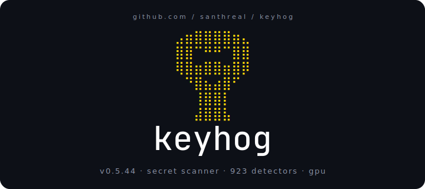
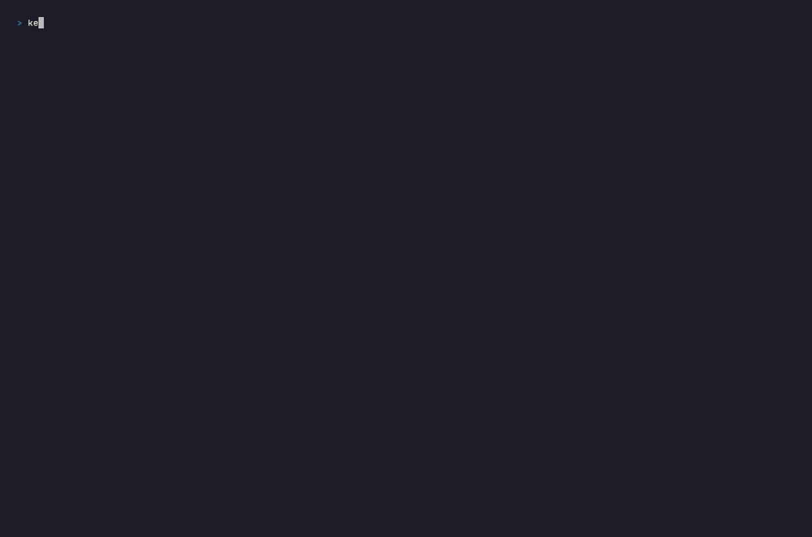
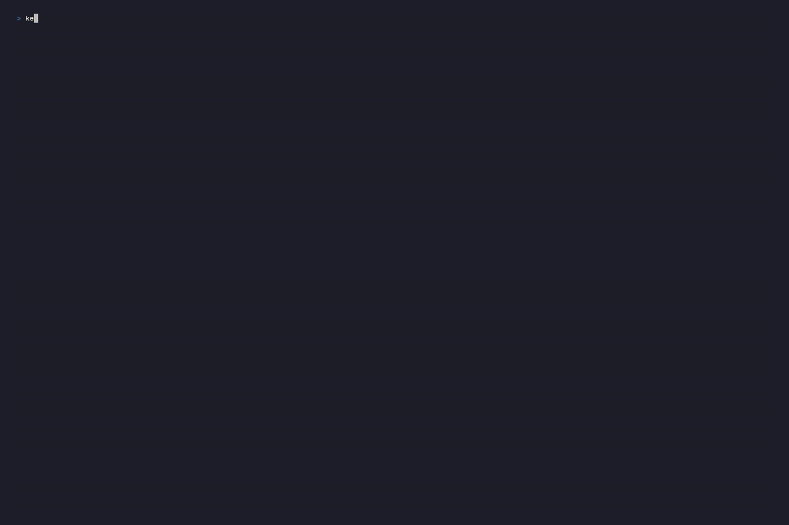
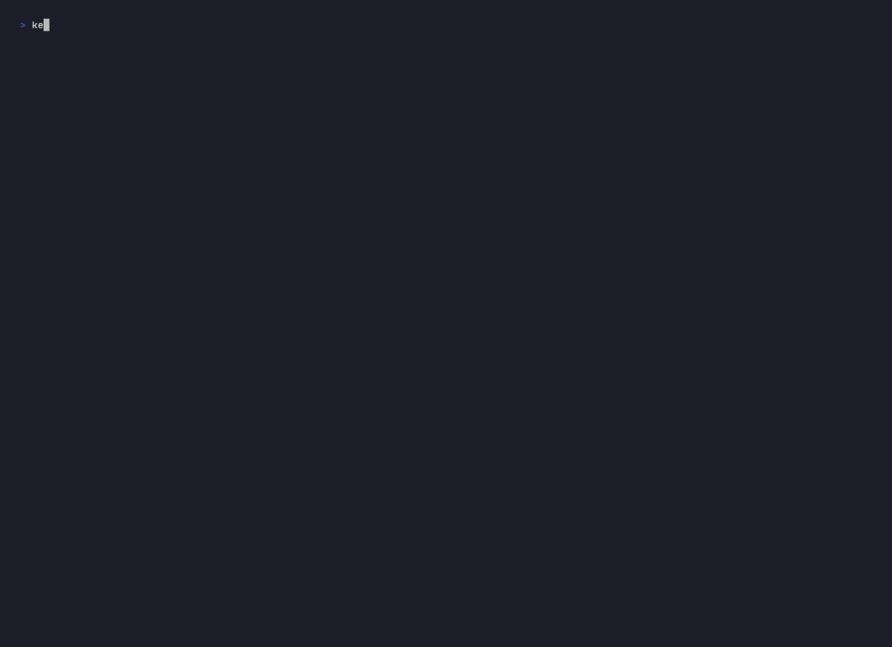
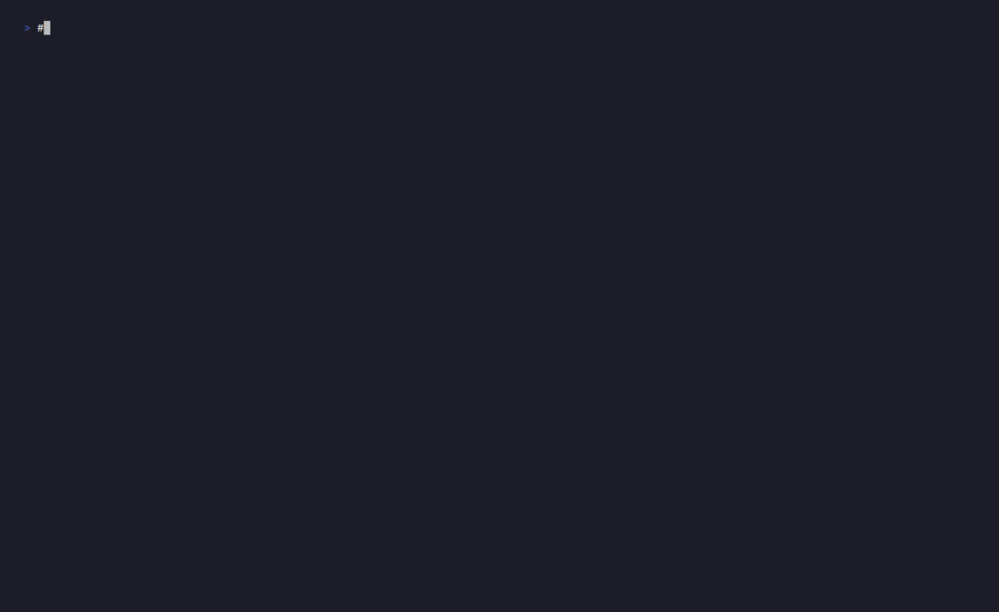
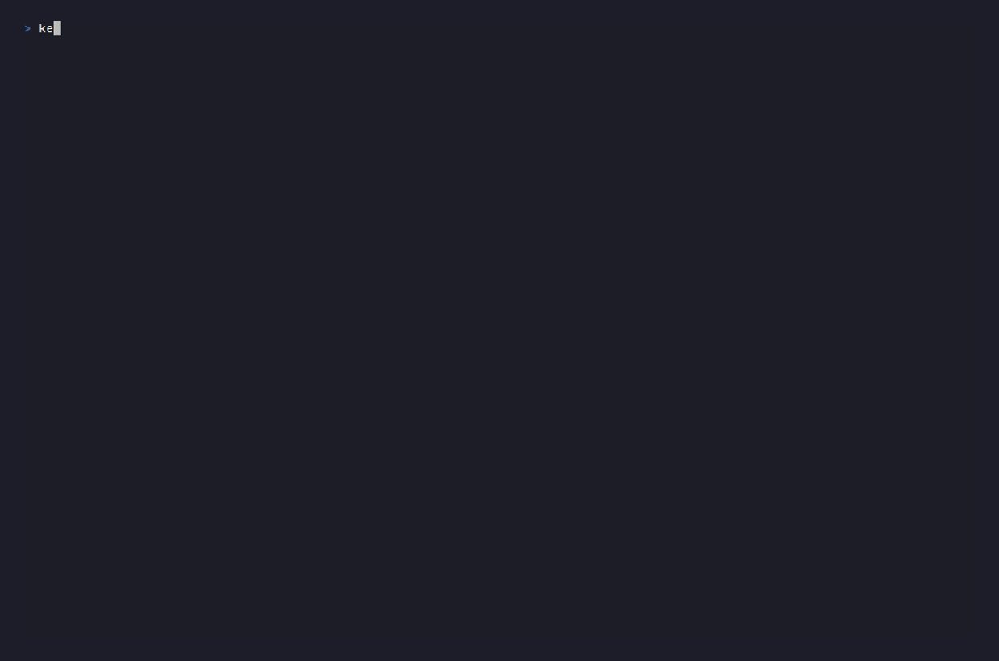

<p align="center">
  
</p>

<p align="center">
  <a href="https://github.com/santhreal/keyhog/releases/latest"></a>&nbsp;
  <a href="LICENSE"></a>&nbsp;
  <a href="https://github.com/santhreal/keyhog/actions"></a>&nbsp;
  <a href="https://star-history.com/#santhreal/keyhog&Date"></a>
</p>

<p align="center">
  <sub>Part of <a href="https://santh.dev">Santh</a> &nbsp;·&nbsp; <a href="https://santh.dev/blog/keyhog/">blog</a> &nbsp;·&nbsp; <a href="https://x.com/SanthProject">@SanthProject</a></sub>
</p>

---

**keyhog** scans source trees, git history, Docker images, GitHub/GitLab/Bitbucket
repository collections, S3/GCS/Azure Blob buckets, and running systems for leaked credentials. **922 embedded detectors**,
decode-through (base64/hex/url/protobuf), confidence scoring, and SARIF output
without hand-written runtime configuration. After verified-install calibration,
`keyhog scan .` works with the canonical defaults; a source-built multi-backend
binary first runs `keyhog calibrate-autoroute`.

<p align="center">
  
</p>

### Add it to your CI (one workflow file)

```yaml
# .github/workflows/keyhog.yml
name: keyhog
on: [push, pull_request]
permissions: { contents: read, security-events: write }
jobs:
  scan:
    runs-on: ubuntu-latest
    steps:
      - uses: actions/checkout@v4
      - uses: santhreal/keyhog/.github/actions/keyhog@v0.5.41
        with: { path: ., severity: high, format: sarif }
```

Release refs download the platform asset; branch/SHA refs build the checked-out
source. With no explicit diagnostic backend, the Action visibly calibrates the
runner before its default auto scan. The job summary reports measured duration;
cost varies with the runner, cache, configuration, and repository. Findings
auto-upload to GitHub code-scanning as SARIF; adopt without breaking an existing tree by committing a baseline
(`keyhog scan --create-baseline .keyhog-baseline.json`) so the action
fails only on NEW secrets.

For system-library-free CI installs use `cargo install keyhog
--no-default-features --features ci`: no Hyperscan dependency, no wgpu/Vulkan
probe, and no libstdc++ link. It retains the same embedded detector and
ML/entropy/decode/multiline
data paths. Use this profile in self-built CI images where binary size
or container cold-start matters; the prebuilt installer above stays the
default for a turnkey single-binary download.

GitLab CI, CircleCI, Drone, BuildKite, Jenkins, pre-commit, Husky, and
lefthook recipes: [integration recipes](docs/src/workflows/integrations.md).

### How it works

KeyHog compiles its 922 detectors into a shared trigger/extraction plan,
uses Hyperscan when that feature is present, decodes nested encodings before
matching, and can apply explicit per-detector Bayesian Beta(α,β) confidence
calibration. Hardware acceleration is an explicit backend selection layer;
every selected backend must preserve the same detector ids and findings
contract:

| Layer / Backend | When | How |
|---|---|---|
| `simdsieve` prefilter | AVX-512 / AVX2 / NEON | Layer 1: skims every file for 12 high-value literal prefixes in one SIMD pass: AWS `AKIA`/`ASIA`, GitHub `ghp_`, OpenAI `sk-proj-`, Slack `xoxb-`/`xoxp-`, SendGrid `SG.`, Square `sq0csp-`, and Stripe `sk_live_`/`sk_test_`/`rk_live_`/`rk_test_` |
| `gpu-region-presence` | discrete GPU + persisted calibration proof | VYRE literal-set region-presence pass on GPU via WGPU (cross-platform) or optional CUDA backend, followed by the shared CPU validation tail |
| `simd-regex` | Hyperscan compiled and live | parallel Hyperscan trigger scan plus full-regex extraction; portable builds do not expose this backend and report `cpu-fallback` instead |
| `cpu-fallback` | portable build or explicit CPU selection | Aho-Corasick prefix + Rust `regex` extraction |

### Autoroute Contract

The goal of autoroute is simple and strict: for every scan, on every supported
OS, architecture, CPU, GPU, driver stack, detector set, config, and workload
shape, KeyHog must pick the fastest backend that returns the same findings.

That means autoroute is not a fixed threshold table, not a hardware-name
heuristic, and not a fallback hierarchy. There is no "GPU primary with CPU
fallback", no "CPU safe default", and no preferred backend that runs when the
decision table is missing. GPU, Hyperscan/SIMD, scalar CPU, and any new engine
are peer candidates. A backend is eligible only after calibration proves two
things for the current binary, detector digest, host profile, and workload
class:

- **Correctness parity:** the candidate returns the same complete redacted raw
  match identity as the reference path: detector metadata, severity, hashed
  credential and companions, full source location/history metadata, entropy,
  confidence, chunk membership, and finding multiplicity.
- **Measured speed:** the candidate is faster than the alternatives on this
  host and workload class, including batching, detector digest, file-size
  distribution, accelerator state, and platform overhead. Calibration records
  store repeated parity-checked trials, not a single lucky timing sample.

The selected decision must be explainable and reproducible. Any cached routing
decision is keyed by exact executable SHA-256, binary version, OS/arch, CPU features, GPU identity,
detector digest, resolved scan-config digest including batch-pipeline route,
calibration schema, and workload-shape buckets. Canonical GPU admission during
calibration shares normal scan identity; deliberately excluding GPU candidates
is isolated as a diagnostic-only calibration identity. Changing any keyed input
invalidates the decision and requires a fresh calibration probe during install
or explicit recalibration. Invalid existing cache records are rejected instead
of being silently trusted. The installer runs a visible autoroute calibration
phase and persists those measured decisions on disk. Normal scans do not
benchmark candidates or rewrite routing records; they either find a valid
persisted fastest-correct decision for the scan class or report an invalid
autoroute state. A missing, stale, invalid, or incomplete decision is not
permission to run SIMD/CPU/GPU as a substitute. Run `keyhog calibrate-autoroute`
to re-prime every preset and workload bucket for the installed binary in place,
or rerun `install.sh --calibrate` / `install.ps1 -Calibrate` to replace the
persisted calibration at install time. Explicit `--backend` overrides are for
diagnostics and benchmarking, not evidence that autoroute is correct.

A single-backend build (one compiled without Hyperscan (`simd`) or the GPU stack,
such as the portable/static release) has no backend *choice* to route, so it
resolves its lone CPU backend directly and never requires calibration (and never
fails closed). Autoroute engages only when a build compiled more than one backend.

The visible calibration phase measures every workload class the current host
can materialize: stdin, small/large files, many-file trees, decode-heavy input, git
history/blobs/diff, a loopback web URL, and a live container image, timing each
backend per class and persisting only a route it can prove fastest (or the sound
lowest measured median among statistically non-dominated routes when confidence
intervals overlap). Backend engagement overhead breaks only an exact median
tie. A materialized class must calibrate successfully; classes whose required
tool, daemon, or fixture cannot be created are reported as unavailable rather
than silently claimed as covered.

Because a scan-policy preset (`--fast`, `--deep`, `--precision`) changes the
scanner fields hashed into the routing digest, each preset resolves a *different*
decision than the default policy. The installer therefore calibrates the default
policy **and** every preset the binary exposes, so `keyhog scan . --fast` (or
`--deep`/`--precision`) resolves a persisted fastest-correct decision instead of
failing closed. The decisions for the default policy and every preset coexist in
one cache file (each keyed by its own resolved-config digest):

<p align="center">
  
</p>

`keyhog backend` prints the hardware probe and a size-keyed capability matrix for
diagnostics. That matrix is advisory; normal `auto` scans do not route from its
static tier thresholds. They consume only persisted fastest-correct decisions
for the exact workload key shown by `keyhog backend --autoroute`.

`keyhog backend --autoroute` is the companion view: it reads the *persisted*
calibration cache and lists which resolved scan configs and workload buckets
already have a fastest-correct decision, the distinct cold-aware one-shot and
warm-daemon routes, representative medians, confidence separation, selection
basis, and whether the cache is stale for this build. When a scan exits with
`autoroute calibration required: no decision for workload bucket …`, this is
how you see what *is* calibrated and recalibrate the gap. Add `--json` for a
stable, scriptable shape.

<p align="center">
  
</p>

The `simdsieve` prefilter is a performance layer, not a separate detector: a
hit surfaces under its **canonical detector id** (`aws-access-key`,
`github-classic-pat`, `slack-bot-token`, …) - identical on every platform and
build, whether the fast path or the full regex engine made the find.

Backend selection is reported on startup (the host line also names the GPU and
`io_uring` when present):

```
v0.5.41 · secret scanner · 922 detectors
⚡ 16 cores | SIMD: AVX-512 | Hyperscan | 922 detectors (6061 patterns) | backend=simd-regex
```

Banner **patterns** is the compiled pattern count shown in the startup banner above
(here 6061). The detector corpus has 922 TOML files (four generic catch-alls -
`generic-api-key`, `generic-keyword-secret`, `generic-password`, `generic-secret`
- plus vendor-specific rules) with ~1697 `[[detector.patterns]]` rows in total.

**Full documentation:** [santhreal.github.io/keyhog](https://santhreal.github.io/keyhog/) - install, first scan, output formats, detection internals, suppressions, verification, pre-commit + CI integration, CLI reference, exit codes, env vars, contributing. Source under `docs/`.

---

## Install

```bash
# Linux / macOS
curl -fsSL https://raw.githubusercontent.com/santhreal/keyhog/main/install.sh | sh

# Windows (PowerShell)
iwr https://raw.githubusercontent.com/santhreal/keyhog/main/install.ps1 -useb | iex

# From source - Linux (default = Hyperscan SIMD; needs libhyperscan-dev + pkg-config)
git clone https://github.com/santhreal/keyhog.git
cd keyhog && cargo build --release -p keyhog

# From source / crates.io - macOS, Windows, or any host without Hyperscan
# (the system-library-free portable build: no pkg-config or GPU stack)
cargo install keyhog --no-default-features --features portable
```

> `install.sh` / `install.ps1` (signed prebuilt) is the recommended path: it
> selects and verifies the platform asset before installation. Download and
> build time depend on the network, host, and cache. For a source build, note that the **default**
> features link Hyperscan (a system lib available on Linux x86_64); on **macOS**
> (incl. Apple Silicon) and any host without the Hyperscan dev libraries, build
> with `--no-default-features --features portable` - the portable CPU path, every
> detection feature, no system-lib or pkg-config dependency.

Works on **Linux**, **macOS** (Intel + Apple Silicon), and **Windows**. The
verified installers calibrate multi-backend builds before enabling default
automatic scans; a source build must run `keyhog calibrate-autoroute` first or
use an explicit diagnostic backend.

The installer selects one asset per OS/architecture. The Linux x86_64 binary
contains Hyperscan plus both VYRE CUDA and WGPU drivers; CUDA/NVRTC are loaded
dynamically, so the same binary works on NVIDIA, other compatible GPUs, and
CPU-only hosts without a build-time CUDA toolkit. Runtime probing reports which
engines are usable, while persisted autoroute evidence selects the
fastest measured-correct engine for each workload. macOS and Windows release
assets are portable no-system-library builds without Hyperscan or GPU drivers.
Each download is verified before it can replace your binary:
the installer checks the release's
**minisign signature** against keyhog's pinned public key and **fails closed**
(refuses to install, touching nothing) if the signature is missing, wrong, or
minisign itself is not installed - in which case it prints the one-line install
command for your OS (`sudo apt-get install minisign`, `brew install minisign`,
`winget install -e --id jedisct1.minisign`). It then SHA256-verifies the binary
against the release-side checksum file. For an offline/air-gapped install
without release verification, pass `--insecure`; the installer labels that
trust downgrade visibly.

Pin a version with `KEYHOG_VERSION=v0.5.41`. Change the install dir with
`--install-dir=/usr/local/bin`. Runtime backend policy belongs to
`keyhog scan --backend ...`, `[system].gpu`, and autoroute calibration, not the
installer asset name.

Three diagnostic modes ship with the same script:
```bash
sh install.sh --diagnose    # print host + binary state, change nothing
sh install.sh --repair      # re-download the platform asset for this host
sh install.sh --uninstall   # remove the binary + installer-owned shell wiring
```

For an interactive install (post-install wizard for PATH, shell completions,
and a git pre-commit hook), download the script first instead of piping into
`sh`:
```bash
curl -fsSL https://raw.githubusercontent.com/santhreal/keyhog/main/install.sh \
    -o keyhog-install.sh
sh keyhog-install.sh
```

Daemon mode is Unix only. Everything
else works identically on Windows.

## Keep keyhog healthy and up to date

Once installed, keyhog maintains itself - the install script is only
needed for the first install:
```bash
keyhog doctor                # health check: host probe + end-to-end scan self-test
keyhog backend --self-test --json # CI-readable GPU path health proof
keyhog update                # self-update to the latest release (verified download + atomic swap)
keyhog update --check        # is a newer release available? (exits 10 if yes, 0 if current)
keyhog repair                # reinstall a known-good binary if the self-test fails (--force to force)
keyhog uninstall             # remove the binary (dry run; pass --yes to actually delete)
```

`keyhog doctor`: host probe, install/PATH resolution, and an end-to-end scan
self-test. On a usable physical-GPU host it additionally checks the production
GPU scan path, GPU literal set, and GPU MoE shader against the CPU reference;
those GPU checks are skipped on hosts without an eligible accelerator:

<p align="center">
  
</p>

`keyhog doctor` reuses the scanner's own hardware probe and runs a real
end-to-end self-test - it plants a synthetic secret and confirms the
binary detects it - so it is the authoritative "will keyhog work here?"
check (the installer runs it automatically after install). `update` and
`repair` download the release binary and GPU-literal sidecar over HTTPS,
verify both minisign signatures against keyhog's embedded public key, require
both release-manifest SHA-256 checksums to match, and install them as one
rollback-protected maintenance operation. A tampered, mismatched, or unsafe
archive is refused. On a healthy host `keyhog update` is the one-command upgrade
path. Implicit update/repair resolution ignores drafts and prereleases and
requires the complete signed host bundle; pass `--version <TAG>` to select an
exact published tag, including a prerelease. Network responses are bounded and
timed out before any installed file is changed.

`keyhog backend --self-test --json` is the machine-readable GPU health
gate for self-hosted runners. It exits `4` when the production GPU
region-presence path fails and emits stable `ok`, `status`, `exit_code`,
`recommended_backend`, and per-probe fields for CI routing.
On a host without an eligible physical GPU it returns one `gpu_adapter` probe
with status `skip` and exits `0`; add `--require-gpu` to make absence a failed
health gate (exit `4`).

## Quickstart

```bash
keyhog scan .                                          # scan a directory
keyhog scan --git-staged                               # pre-commit: only staged blobs
keyhog scan --git-diff main                            # files changed since base ref
keyhog scan --git-history .                            # added lines in commits reachable from HEAD
keyhog scan --docker-image registry/app:v1             # Docker image layers
keyhog scan --s3-bucket logs-prod --s3-prefix /        # S3 objects (--s3-endpoint for non-AWS)
keyhog scan --gcs-bucket logs-prod --gcs-prefix config/ # GCS objects (--gcs-endpoint for compatible APIs)
keyhog scan --azure-container-url "$AZURE_CONTAINER_URL" --azure-prefix config/
KEYHOG_GITHUB_TOKEN="$GH_PAT" keyhog scan --github-org acme # every repo in a GitHub org
KEYHOG_GITLAB_TOKEN="$GL_PAT" keyhog scan --gitlab-group acme # every project in a GitLab group
KEYHOG_BITBUCKET_USERNAME="$BB_USER" KEYHOG_BITBUCKET_TOKEN="$BB_APP_PASSWORD" \
  keyhog scan --bitbucket-workspace acme
keyhog scan-system --space 50G                         # walk every drive, every git history
```

Filter, format, gate:

```bash
keyhog scan . --severity high                  # info | client-safe | low | medium | high | critical
keyhog scan . --min-confidence 0.5             # raise the ML floor
keyhog scan . --format sarif -o keyhog.sarif   # GitHub code scanning
keyhog scan . --verify                         # live-verify against vendor APIs
keyhog scan . --create-baseline .keyhog-baseline.json
keyhog scan . --baseline .keyhog-baseline.json # only NEW findings vs snapshot
keyhog scan . --fast                           # pre-commit speed (no entropy/ML/decode recursion)
keyhog scan . --deep                           # max detection depth
keyhog scan . --incremental                    # BLAKE3 Merkle skip → 10-100× CI loop
```

One scan, every CI/SIEM dialect: `text · json · jsonl · sarif · csv · html · junit · github-annotations · gitlab-sast`, all from the same engine:

<p align="center">
  
</p>

Exit codes: `0` clean, `1` findings above the severity floor, `2` user error
(bad path, bad config, unsupported flag), `3` system error or detector-corpus
audit failure, `4` `backend --self-test` failed, `10` live credentials found
(requires `--verify`), `11` scanner panic (thread panicked mid-scan), `12` required GPU
unavailable, `13` requested source failed or input coverage was incomplete. Matches
`keyhog --help`.

## What it catches

922 embedded detectors with checksum / companion validation:

- **Cloud providers:** AWS (access key + secret + STS verification),
  Azure (subscription key, storage account key, SAS), GCP (service account,
  API key), Cloudflare, Heroku, Vercel, Supabase.
- **Payment processors:** Stripe, Braintree, Razorpay, Paddle, Plaid,
  Square, and PayPal, all with companion-required validation (a Braintree
  private key without its public counterpart never fires).
- **Source forges:** GitHub PATs (with CRC32 checksum), GitLab tokens,
  Bitbucket app passwords, npm tokens (with checksum), Gitea / Forgejo
  / Codeberg.
- **Auth / SSO:** Okta, Auth0, Clerk, JumpCloud, Kinde.
- **Comms:** Slack, Discord, Twilio, SendGrid, Postmark, Mailgun,
  Resend, Loops.
- **AI / ML:** OpenAI (sk-/sk-proj-), Anthropic, Google AI Studio,
  Cohere, Mistral, HuggingFace, Replicate.
- **Databases:** Postgres connection strings, MongoDB Atlas, Supabase
  service-role, PlanetScale, Neon, Turso, MySQL, Redis URLs.
- **Generic + entropy discovery:** `API_KEY=<high-entropy-blob>` catches
  credentials with no named detector, gated by per-context entropy
  thresholds + ML scoring.
- **Cryptographic material:** RSA / EC / SSH private keys, PGP private
  blocks, JWT signing secrets.

Each detector ships as a [TOML file](./detectors/) (data, not code):
service metadata, regex patterns, keywords, companion fields,
verification handler. Adding a new detector is 5-10 lines of TOML;
the [contributor guide](./CONTRIBUTING.md) walks through it.

`keyhog explain <id>` dumps any detector's full spec: patterns, keywords,
verification endpoint, plus a service-keyed rotation and step-by-step
remediation guide, so a finding is never a black box:

<p align="center">
  
</p>

Browse detector authoring and inspection in the
[detector reference](docs/src/detectors.md), or query the installed corpus with
`keyhog detectors --search <term> --verbose`.

## Why higher recall, fewer false positives

- **Decode-through scanning.** Kubernetes `Secret` manifests, JWT payloads,
  base64-wrapped envs, helm values, and docker-config `auth:` blobs. The
  structured preprocessor decodes them in place and feeds every
  downstream detector the plaintext, so detectors don't each need to
  re-implement decoding. Decode-enabled scans also recover recognized,
  side-effect-free JavaScript byte-array XOR and AES-256-CBC expressions when
  all recovery material is embedded; KeyHog never executes the source.
- **Multiline reassembly.** `"sk-proj-" + \` continuation in JavaScript,
  YAML multi-line strings, Makefile backslash-continuation, Helm /
  Jinja templated outputs, all reassembled before regex matching.
- **Companion-required validation.** AWS access key without its 40-char
  secret? Skipped. Twilio API key without its auth token? Skipped.
  Two-out-of-two signals are required for the high-noise detectors,
  cutting the canonical `git log -G ghp_` false-positive cluster.
- **Confidence scoring.** Every finding carries a `[0.0, 1.0]` score
  derived from Shannon entropy, surrounding context, companion match,
  checksum (GitHub CRC32, npm, Slack), and a small ML classifier
  (~30k params). Default threshold `0.40` (the canonical
  `ScanConfig::default()` floor; same as the `--min-confidence` default
  and the `[scan].min_confidence` example below) filters low-quality
  matches without hiding real secrets.
- **Bayesian per-detector calibration.** `keyhog calibrate --fp generic-api-key`
  writes a Beta(α,β) posterior. Scans use it only when `--calibration-cache`
  or `[system].calibration_cache` points at that file, so confidence tuning is
  explicit and reproducible instead of depending on stray host cache state.

## Performance

Measured head-to-head against Betterleaks, Kingfisher, TruffleHog, and
Titus, scored identically by the reproducible harness in
[`benchmarks/`](benchmarks/): the SecretBench containment rule, with the
ground-truth manifest **excluded from every scanner's scan tree** so no tool
is ever shown the answer key. The tables below are generated by
`make -C benchmarks report`: **do not edit them by hand.**

### Detection leaderboard

<!-- BENCH:leaderboard:start -->
Corpus: **mirror** - 15000 fixtures, 3000 labeled positives. Every scanner scored identically (SecretBench overlap rule); the answer-key manifest is excluded from the scan tree.

| Rank | Scanner | F1 | Precision | Recall | Findings | Wall | Peak RSS |
|---|---|---|---|---|---|---|---|
| 1 | **KeyHog** | **0.9258** | 0.9954 | 0.8653 | 2612 | 1.58s | 1543 MB |
| 2 | TruffleHog | 0.5265 | 1.0000 | 0.3573 | 1072 | 1.45s | 322 MB |
| 3 | Kingfisher | 0.4720 | 0.3912 | 0.5947 | 5241 | 3.81s | 502 MB |
| 4 | Titus | 0.4127 | 0.3318 | 0.5457 | 5159 | 4.13s | 114 MB |
| 5 | Nosey Parker | 0.4078 | 0.3414 | 0.5063 | 4532 | 0.82s | 534 MB |
| 6 | Betterleaks | 0.3585 | 0.2313 | 0.7967 | 10828 | 1.04s | 210 MB |
<!-- BENCH:leaderboard:end -->

### Speed & memory

<!-- BENCH:perf:start -->
| Scanner | Config | Corpus | Wall | Throughput | Peak RSS |
|---|---|---|---|---|---|
| Nosey Parker | `default-nocache-nodaemon-no-git-history` | mirror | 0.75s | 3.1 MB/s | 285 MB |
| Betterleaks | `default-nocache-nodaemon-no-validate` | mirror | 0.77s | 3.0 MB/s | 192 MB |
| Nosey Parker | `default-nocache-nodaemon-no-git-history` | mirror | 0.82s | 2.8 MB/s | 534 MB |
| Nosey Parker | `default-nocache-nodaemon-no-git-history` | creddata | 0.92s | 1056.3 MB/s | 1743 MB |
| Betterleaks | `default-nocache-nodaemon-no-validate` | mirror | 1.04s | 2.2 MB/s | 210 MB |
| KeyHog | `simd-nocache-nodaemon-full` | mirror | 1.27s | 1.8 MB/s | 1137 MB |
| KeyHog | `simd-nocache-nodaemon-full` | mirror | 1.32s | 1.8 MB/s | 1153 MB |
| KeyHog | `simd-nocache-nodaemon-full` | mirror | 1.40s | 1.7 MB/s | 1745 MB |
| TruffleHog | `default-nocache-nodaemon-no-verify` | mirror | 1.45s | 1.6 MB/s | 322 MB |
| KeyHog | `simd-nocache-nodaemon-full` | mirror | 1.58s | 1.5 MB/s | 1543 MB |
| TruffleHog | `default-nocache-nodaemon-no-verify` | mirror | 1.73s | 1.3 MB/s | 308 MB |
| Titus | `default-nocache-nodaemon-no-validate` | mirror | 2.53s | 0.9 MB/s | 117 MB |
| Betterleaks | `default-nocache-nodaemon-no-validate` | creddata | 2.83s | 342.8 MB/s | 252 MB |
| Betterleaks | `default-nocache-nodaemon-no-validate` | creddata | 3.07s | 316.5 MB/s | 261 MB |
| Titus | `default-nocache-nodaemon-no-validate` | creddata | 3.16s | 307.6 MB/s | 2024 MB |
| KeyHog | `simd-nocache-nodaemon-full` | creddata | 3.31s | 293.8 MB/s | 1887 MB |
| KeyHog | `cpu-nocache-nodaemon-full` | creddata | 3.45s | 281.7 MB/s | 1821 MB |
| KeyHog | `auto-nocache-nodaemon-full` | creddata | 3.52s | 275.9 MB/s | 1850 MB |
| Kingfisher | `default-nocache-nodaemon-low-no-validate` | mirror | 3.81s | 0.6 MB/s | 502 MB |
| KeyHog | `simd-nocache-nodaemon-full` | creddata | 3.91s | 248.5 MB/s | 1741 MB |
| KeyHog | `simd-nocache-nodaemon-full` | creddata | 3.99s | 243.7 MB/s | 1720 MB |
| KeyHog | `simd-nocache-nodaemon-full` | creddata | 4.02s | 241.7 MB/s | 1962 MB |
| KeyHog | `simd-nocache-nodaemon-full` | creddata | 4.05s | 240.0 MB/s | 1677 MB |
| Titus | `default-nocache-nodaemon-no-validate` | mirror | 4.13s | 0.6 MB/s | 114 MB |
| Kingfisher | `default-nocache-nodaemon-low-no-validate` | mirror | 4.88s | 0.5 MB/s | 421 MB |
| KeyHog | `gpu-nocache-nodaemon-full` | creddata | 5.12s | 189.7 MB/s | 3562 MB |
| KeyHog | `simd-nocache-nodaemon-full` | creddata | 5.44s | 178.6 MB/s | 1641 MB |
| Kingfisher | `default-nocache-nodaemon-low-no-validate` | creddata | 7.36s | 131.9 MB/s | 728 MB |
| Kingfisher | `default-nocache-nodaemon-low-no-validate` | creddata | 8.13s | 119.4 MB/s | 657 MB |
| TruffleHog | `default-nocache-nodaemon-no-verify` | creddata | 19.98s | 48.6 MB/s | 644 MB |
<!-- BENCH:perf:end -->

### Per-category recall gaps (where a competitor still wins recall)

<!-- BENCH:gaps:start -->
| Category | KeyHog P/R/F1 | KeyHog TP/FN | Best competitor P/R/F1 | Recall gap |
|---|---|---|---|---|
| `authentication-key` | 1.000 / 0.973 / 0.986 | 498/14 | Betterleaks 0.893 / 0.977 / 0.933 | +0.004 |
| `generic-high-entropy-string` | 1.000 / 0.348 / 0.516 | 63/118 | Betterleaks 1.000 / 0.807 / 0.893 | +0.459 |
<!-- BENCH:gaps:end -->

Reproduce: `make -C benchmarks bench` runs every scanner on the 15k
SecretBench-mirror corpus and writes `benchmarks/results/<host>/`;
`make -C benchmarks report` regenerates the tables above and
`benchmarks/reports/`. See [`benchmarks/README.md`](benchmarks/README.md)
for the corpora (mirror, competitor home-turf, Samsung/CredData) and the
backend/cache/daemon/OS/GPU matrix.

## CI integration

### GitHub Actions

```yaml
- uses: santhreal/keyhog/.github/actions/keyhog@v0.5.41
  with:
    path: .
    severity: high       # info | client-safe | low | medium | high | critical
    format: sarif        # SARIF auto-uploads to GitHub code scanning
    baseline: .keyhog-baseline.json   # block only NEW findings
```

Release tags and explicit `version:` inputs require a matching prebuilt
binary plus checksum and fail closed if the asset is missing or unverifiable.
Branch/SHA action refs may build from source with Cargo. SARIF carries
CWE-798 + OWASP A07:2021 taxa on every finding.

### CI never needs a GPU

**Hosted CI should run pure CPU/SIMD unless it has a real GPU.**
Use `keyhog scan --no-gpu` or `.keyhog.toml` `[system].gpu = "off"` on
hosted runners. Use `--require-gpu` or `[system].gpu = "required"` on
self-hosted GPU runners where a driver or runtime dispatch regression must fail
closed with exit `12`. An explicit or autoroute-selected GPU route is also a
hard execution contract: KeyHog never completes it through CPU/SIMD.
Detection results are identical on CPU and GPU - the GPU only changes
throughput, never which secrets are found.

Building keyhog from source in CI (rather than the prebuilt binary)?
Use the `portable` feature - every detection feature, no system-library
build deps (skips the Hyperscan/Ghidra build step):

```yaml
- run: cargo install keyhog --no-default-features --features portable
- run: keyhog scan . --format sarif --severity high > keyhog.sarif
```

Other CIs, hook recipes, and SARIF behavior live in the canonical
[CI guide](docs/src/workflows/ci.md) and
[integration recipes](docs/src/workflows/integrations.md).

### Pre-commit hook

```bash
keyhog hook install                    # writes .git/hooks/pre-commit
keyhog hook uninstall                  # removes the keyhog-generated hook
```

The installed hook calls `keyhog scan --fast --git-staged --backend cpu`
on every commit. If `keyhog` is missing from `PATH`, the hook blocks the
commit because the security scan did not run; install KeyHog, fix `PATH`,
or remove `.git/hooks/pre-commit` if the repository should not be protected.
Staged/diff scans use the in-process orchestrator because they need
git-aware source expansion and policy handling. The daemon fast path is
for editor-save and hook glue that scans stdin or one regular file.

Or via the `pre-commit` framework:

```yaml
repos:
  - repo: https://github.com/santhreal/keyhog
    rev: v0.5.41
    hooks:
      - id: keyhog
```

## Daemon mode

The daemon keeps the compiled scanner and calibrated backend state warm for
eligible repeated stdin and single-file scans. Actual latency depends on the
binary, corpus, host, accelerator state, cache warmth, and input size; measure
it on the deployment host instead of relying on copied benchmark numbers.

```bash
keyhog daemon start                    # Unix socket via runtime/cache/temp resolution
keyhog scan --stdin --daemon < .env
keyhog daemon status
keyhog daemon stop
```

Daemon scans are scanner-only and apply to eligible stdin or single
regular-file inputs. They return findings before baseline filtering,
Merkle skip-cache, and live verification; directory, git, remote,
baseline, `--verify`, backend/GPU/autoroute, and policy-changing scans
run in-process. `--daemon=on` fails loudly when the daemon cannot honor
the requested scan exactly. The v4 handshake also rejects package, Git-build,
or detector-rules mismatches, including a same-version daemon started with a
custom corpus; `--daemon=auto` reports that refusal before running in process.

Use it in IDE save handlers, stdin/single-file hook glue, or per-commit
CI loops that feed one file at a time. See the
[daemon workflow](docs/src/workflows/daemon.md) for routing and lifecycle semantics.

Watch mode is a separate foreground filesystem-event loop; it does not connect
to the daemon socket or appear in `keyhog daemon status`. For IDEs:

```bash
keyhog watch ./src                     # inotify/FSEvents/RDCW
```

## System-wide credential triage

```bash
sudo keyhog scan-system --space 50G                  # default 50 GiB ceiling
sudo keyhog scan-system --space 1T --include-network # also scan NFS / SMB
sudo keyhog scan-system --space 10G --no-git-history # skip historical blobs
```

Enumerates every mounted drive (skipping pseudo-FS like `/proc`,
`/sys`, `tmpfs`, `nsfs`, `fuse.snapfuse`), auto-discovers every `.git`
(worktrees + bare repos + submodules), and runs the full scan +
git-history pipeline. Honors a hard `--space <bytes>` ceiling and
exits 1 on findings. Built for incident-response triage, M&A
inheritance audits, and quarterly developer-laptop sweeps.

## Lockdown mode (security-critical embeddings)

For deployments where keyhog runs **on the same machine that holds the
secrets** (e.g. paired with [EnvSeal](https://github.com/santhsecurity/envseal))
and there is no trusted boundary between the scanner and the
credentials it inspects:

```bash
keyhog scan . --lockdown
```

Enforces:

- `mlockall(MCL_CURRENT|MCL_FUTURE)` on Linux: credentials never page
  to swap.
- `PR_SET_DUMPABLE = 0` (always on, even outside lockdown): disables
  core dumps, ptrace, `/proc/<pid>/mem` reads. macOS gets
  `PT_DENY_ATTACH`.
- `setrlimit(RLIMIT_CORE, 0)` on Linux: the kernel refuses to write any
  core file regardless of the system `coredump_filter`, so anonymous
  pages can never reach disk via the dump path.
- Refuses to run if `~/.cache/keyhog/*` exists, refuses
  `--incremental` writes, refuses `--verify`, refuses
  `--show-secrets`, refuses `--fast` / `--no-decode` / `--no-entropy` /
  `--no-ml` / `--no-unicode-norm` / `--no-default-excludes` (each
  trades off detection completeness for speed; lockdown is for the
  highest-stakes runs where you want every gate engaged).

The always-on hardening (everything except mlock + cache refusal) is
applied to every KeyHog invocation. Even without `--lockdown`, the
KeyHog process cannot be core-dumped or traced through `ptrace`.

## Library API

```rust
use keyhog_core::{Chunk, ChunkMetadata};
use keyhog_scanner::CompiledScanner;

// Built-in embedded detectors, parsed through the fail-closed loader.
let detectors = keyhog_core::load_embedded_detectors_or_fail()?;
let scanner = CompiledScanner::compile(detectors)?;

let findings = scanner.scan(&Chunk {
    data: "TOKEN=sk_live_EXAMPLE…".into(),
    metadata: ChunkMetadata::default(),
});
```

The no-backend library methods are deterministic portable CPU references; they
do not consult host heuristics or the CLI's calibration cache. Use
`scan_with_backend` or `scan_coalesced_with_backend` for an explicit
Hyperscan/GPU engine. The `keyhog` CLI owns persisted fastest-correct autoroute.
The explicit-backend library methods return infallible finding vectors, so the
selected backend is a hard process contract: unavailable SIMD terminates with
exit `3`, and unavailable or failed GPU execution terminates with exit `12`
instead of returning findings from another engine. Call `warm_backend` to probe
startup eligibility; use the CLI as a subprocess when an embedder must contain
runtime accelerator failure.

Mix shipped + custom detectors by concatenating before compile. The
scanner is `Send + Sync`; share one across rayon workers. Streaming
source helpers in `keyhog-sources` (file-system, git, stdin, Docker,
S3, GCS, Azure Blob, GitHub org, GitLab group, Bitbucket workspace). Live verification in `keyhog-verifier`.

The library boundary is documented in the
[architecture guide](docs/src/architecture.md) and crate-level Rust docs.

## Configuration

Per-repo defaults via `.keyhog.toml`:

```toml
[scan]
severity = "high"
min_confidence = 0.40          # canonical default; raise toward 0.85 for fewer FPs
exclude = ["**/test/fixtures/**", "vendor/"]
gpu_batch_input_limit = "512MB" # optional; otherwise VRAM-adaptive

[limits]
stdin_bytes = "10MB"
web_response_bytes = "10MB"
cloud_max_objects = 100000
git_total_bytes = "256MB"
hosted_git_pages = 1000
docker_tar_total_bytes = "8GB"

[detector.generic-api-key]
enabled = false                # accelerated slots use this same canonical id

[detector.twilio-api-key]
min_confidence = 0.6           # per-detector floor; overrides the global one

[lockdown]
require = true                 # refuse to run unless --lockdown is passed

[system]
autoroute_cache = "/home/alice/.cache/keyhog/autoroute.json"  # or "off"
calibration_cache = "/home/alice/.cache/keyhog/calibration.json"
batch_pipeline = false                                       # true only for diagnostics/calibration
gpu = "auto"                                                 # auto | off | required

[aws]
canary_accounts = []           # extra 12-digit canary issuer accounts
knockoff_accounts = []         # treated the same way: do not live-verify

[tuning]
fallback_hs = true             # scanner recall-route defaults; printed by config --effective
hs_prefilter_max_len = 4096
hs_shard_target = 320
decode_focus = true
confirmed_suffix_gate = true
no_candidate_gate = true
gpu_recall_floor = false
gpu_moe_timeout_ms = 30000
```

Precedence (rightmost wins): compiled defaults → `.keyhog.toml`
(walked up from the scan path) → CLI flags. The canonical defaults live in
`ScanConfig::default()` (`crates/core/src/config.rs`). Full reference:
[`docs/src/reference/configuration.md`](./docs/src/reference/configuration.md).

`keyhog config --effective <path>` prints the exact resolved scan and report
policy (without scanning), so the precedence chain is provable
(here a CLI `--min-confidence 0.6` overrides the compiled `0.40` default):

<p align="center">
  
</p>

Suppress a known finding by credential hash, path glob, or detector id in
`.keyhogignore`, with optional `reason`, `expires`, and `approved_by`
governance metadata. See [Suppressions](./docs/src/suppressions.md) for rule
ordering, inline directives, and composable `.keyhogignore.toml` predicates.

```
# .keyhogignore - gitignore-style shorthand
*.log
node_modules/
9d6060e21ef8d5daec9cfe4a44b1b1bc9792246bfad28210edaaa1782a8a676a

# Explicit form with governance
hash:9f86d081…    ; reason="rotated 2026-04-25" ; expires=2026-07-01 ; approved_by="security@acme"
detector:demo-token
path:**/fixtures/*.env
```

Entries past `expires` fail allowlist load with an actionable error, forcing the
approval to be renewed or removed before the scan can proceed.

## Architecture

> **Contributor map:** [Architecture](./docs/src/architecture.md) is the
> one-page guide to the whole repo: every top-level directory, the crate
> layering, and the bytes→finding pipeline with each stage pointing at the
> module that owns it. Start there to navigate the code.

```
crates/
  core/       Detector loading, finding types, reporting (text/JSON/SARIF), allowlists
  scanner/    Hardware routing, Hyperscan, GPU, decode-through, entropy, ML, multiline
  sources/    File system, git (staged/diff/history), stdin, Docker, S3, GCS, Azure Blob, GitHub/GitLab/Bitbucket, web
  verifier/   Live credential verification for detectors with an active `[detector.verify]` endpoint
  cli/        CLI binary, daemon, watch, baselines, calibrate, hook installer
detectors/    922 TOML files (data, not code)
docs/src/     Canonical mdBook documentation deployed to GitHub Pages
benchmarks/   Reproducible eval harness: corpus generators, scanner adapters, scorer, gate, README report generator
tools/        Contract generators (gen_contracts.py, gen_companion_contracts.py)
```

Two-phase coalesced scan:

1. **Phase 1:** shared trigger scan on raw bytes, parallel across all files
   via rayon. Hyperscan accelerates this phase when compiled; portable builds
   use the pure-Rust trigger path. Files with no trigger hit stop before extraction.
2. **Phase 2:** full extraction on hits only: regex capture groups,
   companion matching, checksum validation, entropy gating, ML
   confidence + explicit Bayesian damping when configured.

Result: extraction work is concentrated on trigger-positive data. Determinism
is part of the contract: same input → same output, byte-exact, every time.

The full pipeline, routing ownership, and profiling entrypoints live in the
[architecture guide](docs/src/architecture.md) and
[backend reference](docs/src/backends.md).

## Other useful subcommands

```bash
keyhog detectors --search aws --verbose      # list / inspect detectors
keyhog explain aws-access-key                # spec, regex, severity, rotation guide
keyhog diff before.json after.json           # NEW / RESOLVED / UNCHANGED for CI gates
keyhog calibrate --tp aws-access-key         # record a true positive
keyhog calibrate --fp generic-api-key        # record a false positive
keyhog calibrate --show                      # posterior-mean bar chart per detector
keyhog scan . --calibration-cache ~/.cache/keyhog/calibration.json
keyhog backend                               # detected hardware + routing matrix
keyhog completion zsh                        # shell completions (bash/zsh/fish/powershell/elvish)
```

## Contributing

- **New detector?** Drop a TOML in [`detectors/`](./detectors/), open a
  PR. The contributor guide ([`CONTRIBUTING.md`](./CONTRIBUTING.md))
  has the schema and a worked example.
- **Bug / missed secret / false positive?** File an issue with the
  redacted credential shape and detector id; each report becomes a
  permanent test fixture under
  [`tests/contracts/`](./crates/scanner/tests/contracts/).
- **Security issue in KeyHog itself?** Don't open a public issue;
  use [GitHub private vulnerability reporting](https://github.com/santhreal/keyhog/security/advisories/new).
  If that form is unavailable, email `security@santh.dev`; PGP is not required.

[Changelog](./CHANGELOG.md). [Open issues](https://github.com/santhreal/keyhog/issues).

## Credits

KeyHog stands on prior secret-scanning work. Ideas borrowed from:

- [TruffleHog](https://github.com/trufflesecurity/trufflehog): detector breadth and verification semantics
- [Betterleaks](https://github.com/betterleaks/betterleaks): token-efficiency and false-positive suppression
- **Titus:** scanning ergonomics and severity calibration

Thanks to these projects and their contributors.

## License

License: MIT OR Apache-2.0.

Terms: [MIT](./LICENSE-MIT) and [Apache-2.0](./LICENSE-APACHE). This dual license covers the code and
detector TOMLs. Commercial use, embedding, forks, and hosted services are
permitted under either license.

---

## Star history

If keyhog has saved you from leaking a credential, a star is the
cheapest way to tell the next person it exists.

<a href="https://star-history.com/#santhreal/keyhog&Date">
  <picture>
    <source media="(prefers-color-scheme: dark)" srcset="https://api.star-history.com/svg?repos=santhreal/keyhog&type=Date&theme=dark" />
    <source media="(prefers-color-scheme: light)" srcset="https://api.star-history.com/svg?repos=santhreal/keyhog&type=Date" />
    
  </picture>
</a>
