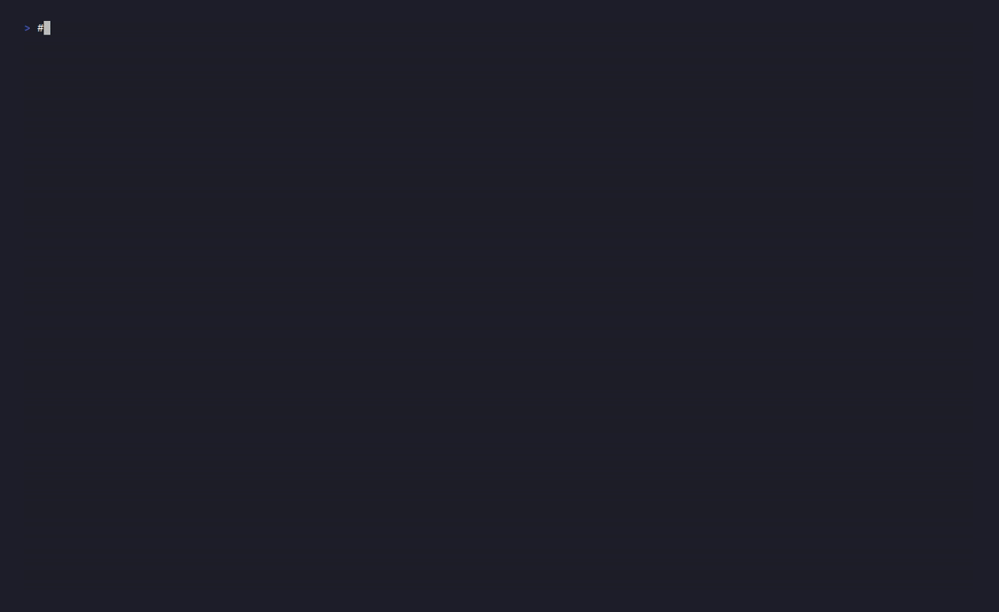

<p align="center">
  
</p>

<p align="center">
  <a href="https://github.com/santhreal/keyhog/releases/latest"></a>&nbsp;
  <a href="LICENSE"></a>&nbsp;
  <a href="https://github.com/santhreal/keyhog/actions"></a>&nbsp;
  <a href="https://star-history.com/#santhreal/keyhog&Date"></a>
</p>

<p align="center">
  <sub>Part of <a href="https://santh.dev">Santh</a> &nbsp;·&nbsp; <a href="https://santh.dev/blog/keyhog/">blog</a> &nbsp;·&nbsp; <a href="https://x.com/SanthProject">@SanthProject</a></sub>
</p>

---

**keyhog** scans source trees, git history, Docker images, GitHub/GitLab/Bitbucket
repository collections, S3/GCS/Azure Blob buckets, and running systems for leaked credentials. **923 embedded detectors**,
decode-through (base64/hex/url/protobuf), confidence scoring, and SARIF output
without hand-written runtime configuration. After verified-install calibration,
`keyhog scan .` works with the canonical defaults; a source-built multi-backend
binary first runs `keyhog calibrate-autoroute`.

The binary banner is `v0.5.48 · secret scanner · 923 detectors`; its
compiled progress line reports `923 detectors (5822 patterns)` together with
the operator-visible route (for example, `backend=simd-regex | gpu=none`).

<p align="center">
  
</p>

### Install and run your first scan

On Linux or macOS:

```sh
curl -fsSL https://santh.dev/keyhog/install.sh | sh
keyhog scan .
```

On Windows PowerShell:

```powershell
iwr https://santh.dev/keyhog/install.ps1 -UseBasicParsing | iex
keyhog scan .
```

KeyHog exits `0` when the scan is clean and `1` when it reports findings above
your severity floor. Exit `1` means the scanner worked. Review each finding's
file, line, detector, and remediation before deciding whether to remove,
rotate, or suppress the credential. Other nonzero codes describe input,
system, verification, or coverage failures; see the
[exit-code reference](https://santhreal.github.io/keyhog/reference/exit-codes.html).

For the next scan, use the [recipes cookbook](https://santhreal.github.io/keyhog/recipes.html)
or the copyable commands in [Quickstart](#quickstart). You can scan git history,
container images, cloud buckets, repository collections, URLs, and a whole
machine without changing tools.

### Add it to your CI (one workflow file)

The `preset` and `lockdown` inputs below are the 0.5.48 candidate contract.
Copy this workflow after the publication verifier proves `@v0` points to
`v0.5.48`; the current public `v0` release does not expose them yet.

```yaml
# .github/workflows/keyhog.yml
name: keyhog
on: [push, pull_request]
permissions: { contents: read, security-events: write }
jobs:
  scan:
    runs-on: ubuntu-latest
    steps:
      - uses: actions/checkout@3d3c42e5aac5ba805825da76410c181273ba90b1 # v7.0.1
      - uses: santhreal/keyhog@v0
        with:
          path: .
          severity: high
          format: sarif
          preset: default
          lockdown: 'false'
```

`preset` accepts `default`, `fast`, `deep`, or `precision`. `default` adds no
preset flag, so a committed `.keyhog.toml` may select `fast = true`,
`deep = true`, or `precision = true`; an explicit non-default Action preset has
normal CLI precedence over the file preset. `lockdown: 'true'` independently
adds `--lockdown`: it may compose with default, deep, or precision, while fast
is refused by the CLI. `[lockdown] require = true` requires that Action input
and does not enable lockdown by itself. Positive Action lockdown requires a
Linux runner with a sufficient memlock limit for the real process. Granting
`CAP_IPC_LOCK` or setting an unlimited `ulimit -l` are provisioning options, but
a sufficiently large finite limit also works. Standard GitHub-hosted Linux
currently fails closed during the real `mlockall` application; hosted
cross-platform positives therefore use `lockdown: 'false'`, and the direct
hosted lockdown lane proves that rejection.

The maintained prepublication source lanes pass explicit `backend: cpu`: the
digest-pinned Rust container runs real root and nested composite Action
CPU+lockdown with `IPC_LOCK` and unlimited memlock, and the cross-platform lanes
exercise clean and precision scans. Source Actions do not request auto without
a persisted routing proof. A local production Docker run independently
completed auto calibration and scanning with `mlocked` status.

Reviewed branch/SHA Action refs build every platform with pinned Rust `1.89.0`
and the portable profile and require explicit `backend: cpu`; accelerated
backends and proof-backed auto require a compatible release binary and runner.
Release refs bootstrap minisign `0.11` only from archives pinned by hardcoded
SHA-256. After 0.5.48 is public, the separate authenticated manual-dispatch
release lane retains default auto, passes one ephemeral `RUNNER_TEMP` autoroute
receipt/cache from calibration to report scan, and deletes it.

Runtime downloads authenticate the binary and GPU literal bundle with minisign
and SHA-256. The 0.5.48 publication contract is an exact 60-asset manifest:
ten payloads (four binaries, four matching GPU-literal sidecars, and two
installers), their adjacent checksum/signature proofs, ten signed SPDX 2.3 JSON
documents, and those documents' adjacent proofs. Binary and sidecar SBOMs bind
attested package-scoped Cargo dependency receipts. The Linux binary additionally
binds statically linked Hyperscan `5.4.2`, exact `libhs.a` and `libhs.pc`
provenance hashes, and `STATIC_LINK`; it does not claim runtime `libhs`.
Installer SBOMs enumerate the compatible signed platform payloads and the real
shell/PowerShell download, hashing, signature, and file utilities they use,
without inventing a Cargo graph. These candidate assets are not public until
the release succeeds. Branch/SHA refs skip release lookup and build the
checked-out source with explicit CPU. Authenticated release refs with no
diagnostic backend visibly calibrate the runner before the default auto scan.
The job summary reports measured duration; cost varies with the runner, cache,
configuration, and repository. Findings auto-upload to GitHub code-scanning as
SARIF. After the report flush, the scanner emits an ordered seven-field internal
receipt: `schema=keyhog-action-report-v1`, `format`, `findings`,
`report-bytes`, `report-sha256`, `scan-status`, and `exit-code`. A hidden
Action-only verifier rehashes the exact requested workspace report bytes,
validates every field, and returns the count without `jq`, Python, or `grep`.
Receipt validation keeps coverage and outcome separate. Advisory coverage gaps
publish `scan-status=partial` while preserving exit `0`, `1`, or `10`; fail-class
coverage gaps use partial exit `13`.
The requested copy keeps the stable
`keyhog-results-<analysis-category>.<ext>` basename but is not the public
output or upload authority and is untrusted after the Action returns. The
wrapper copies verified bytes to a mode-`0400` snapshot inside a unique
mode-`0700` runtime below the unpredictable
`RUNNER_TEMP/keyhog-action-runtime.*/report-snapshot.*/` parent and verifies
that snapshot against the same receipt. The public `report` output names that
snapshot, and `report-present` is true only after it is published. SARIF and
artifact uploads recheck its SHA-256 immediately before use. The snapshot is
available to downstream steps in the same job and disappears with runner job
cleanup. It is private, not immutable against another process under the same
runner UID; publication-time receipt validation is not a promise that later
bytes are unchanged. Receipt and snapshot paths are implementation details, not
public CLI APIs.

Adopt without breaking an existing tree by committing a baseline
(`keyhog scan --create-baseline .keyhog-baseline.json`) so the action
fails only on NEW secrets.

Release-tag behavior is fail-closed: exact release tags and the floating
`@v0` tag require complete, verifiable release assets. A missing or
unverifiable asset never silently falls back to building different source;
only branch/SHA refs build from source.

For lean CI source builds, disable default features and select the CI profile:

```sh
cargo install keyhog --no-default-features --features ci
```

This profile has no Hyperscan dependency, wgpu/Vulkan probe, or libstdc++ link.
Native TLS still needs the platform's TLS build prerequisites. On Debian/Ubuntu,
install `libssl-dev` and `pkg-config`. The profile retains the same embedded
detector and ML/entropy/decode/multiline data paths. Use it in self-built CI
images where binary size
or container cold-start matters; the prebuilt installer above stays the
default for a turnkey single-binary download.

For GitLab CI, CircleCI, Drone, Buildkite, Jenkins, pre-commit, Husky, and
lefthook, start with the
[integration recipes](https://santhreal.github.io/keyhog/workflows/integrations.html).
Use `keyhog hook install` to protect local commits. The
[pre-commit guide](https://santhreal.github.io/keyhog/workflows/precommit.html)
explains staged-content scanning, hook replacement, bypass, and removal. The
[CI guide](https://santhreal.github.io/keyhog/workflows/ci.html) covers the
maintained workflows, baseline adoption, report retention, and exit handling.

### How it works

KeyHog compiles its 923 detectors into a shared trigger/extraction plan,
uses Hyperscan when that feature is present, decodes nested encodings before
matching, and can apply explicit per-detector Bayesian Beta(α,β) confidence
calibration. Hardware acceleration is an explicit backend selection layer;
every selected backend must preserve the same detector ids and findings
contract:

| Layer / Backend | When | How |
|---|---|---|
| `simdsieve` prefilter | AVX-512 / AVX2 / NEON | Layer 1: skims every file for 12 high-value literal prefixes in one SIMD pass: AWS `AKIA`/`ASIA`, GitHub `ghp_`, OpenAI `sk-proj-`, Slack `xoxb-`/`xoxp-`, SendGrid `SG.`, Square `sq0csp-`, and Stripe `sk_live_`/`sk_test_`/`rk_live_`/`rk_test_` |
| `gpu-cuda-region-presence` | executable CUDA peer + persisted calibration proof | VYRE literal-set region-presence through CUDA, followed by the shared CPU validation tail |
| `gpu-wgpu-region-presence` | executable WGPU peer + persisted calibration proof | VYRE literal-set region-presence through WGPU, followed by the shared CPU validation tail |
| `simd-regex` | Hyperscan compiled and live | parallel Hyperscan trigger scan plus full-regex extraction; portable builds do not expose this backend and report `cpu-fallback` instead |
| `cpu-fallback` | portable build or explicit CPU selection | Aho-Corasick prefix + Rust `regex` extraction |

### Autoroute

KeyHog autoroute measures every eligible backend with phase-two localization on
and off, then persists the fastest parity-checked route for the exact binary,
host, resolved policy, and workload class. It is not a hardware heuristic or
fallback hierarchy. A missing, stale, invalid, or quarantined decision is never
called autoroute: KeyHog warns, scans every byte through the scalar correctness
oracle, and reports `complete_after_recovery` with the recalibration command.

Install performs the visible calibration. To recalibrate an installed binary,
run `keyhog calibrate-autoroute`; inspect evidence with
`keyhog backend --autoroute`. Explicit `--backend` values are diagnostic and
benchmark overrides, not autoroute proof. Single-backend portable builds do
not need a routing cache.

If an automatically selected accelerated backend faults, KeyHog warns and
replays the same stable input through the fastest remaining measured-correct
peer. GPU recovery retains completed shards and scans only exact unprocessed
ranges. KeyHog reports `complete_after_recovery`. The affected workload route is
quarantined in a bounded runtime-health artifact separate from calibration
timings, so a restart cannot retry it. Successful recalibration clears only the
repaired workload identities. Explicit or required backends remain hard
contracts and are never substituted.

The complete parity contract, workload identity, GPU/Hyperscan behavior, daemon
semantics, cache lifecycle, and troubleshooting matrix live in the
[autoroute reference](docs/src/reference/autoroute-calibration.md).

**Full documentation:** [santhreal.github.io/keyhog](https://santhreal.github.io/keyhog/) - install, first scan, output formats, detection internals, suppressions, verification, pre-commit + CI integration, CLI reference, autoroute, exit codes, env vars, and contributing. Source under `docs/`.

---

## Install

The canonical installer endpoints are short and stable:

```sh
# Linux / macOS
curl -fsSL https://santh.dev/keyhog/install.sh | sh

# Windows PowerShell
iwr https://santh.dev/keyhog/install.ps1 -UseBasicParsing | iex
```

The installer verifies the selected release artifact before replacing a binary.
For an installation that authenticates the installer script itself before
execution, use the pinned signed flow below.

The installer needs `minisign` before it can verify anything. The Linux release
binary statically links Hyperscan and does not require `libhyperscan5`. On
Debian/Ubuntu, run
`sudo apt-get update && sudo apt-get install -y --no-install-recommends curl minisign`;
on macOS, run `brew install minisign` and use the system `curl`.

```bash
# Linux / macOS, pinned and authenticated before execution
TAG=v0.5.48
BASE="https://github.com/santhreal/keyhog/releases/download/$TAG"
PUB='RWTPnJ/p6xVJ3TJIxr+ZVHMD/MTHWZhsdE38Go/oD3DYBoi4bePR55go'
curl -fSLO "$BASE/install.sh"
curl -fSLO "$BASE/install.sh.minisig"
minisign -Vm install.sh -P "$PUB"
KEYHOG_VERSION="$TAG" sh install.sh

# Windows uses the same signed, versioned flow. See the install guide.

# From source - Linux (install libhyperscan-dev + libssl-dev + pkg-config first)
git clone https://github.com/santhreal/keyhog.git
cd keyhog && cargo build --release -p keyhog

# From source - macOS Hyperscan path (Homebrew)
brew install vectorscan pkg-config
cargo install keyhog

# Portable scanner build - Windows or a host without Hyperscan/Vectorscan
# (no Hyperscan or GPU stack; native TLS build prerequisites still apply)
cargo install keyhog --no-default-features --features portable
```

> The signed versioned installer is the recommended path. It authenticates the
> installer before execution, then selects and verifies the platform asset. See
> the [install guide](https://santhreal.github.io/keyhog/install.html) for
> PowerShell and checksum commands. Download and
> build time depend on the network, host, and cache. For a source build, note
> that the **default**
> features link Hyperscan/Vectorscan. Linux source builds also require
> `libssl-dev` and `pkg-config` for native TLS. Linux uses
> `libhyperscan-dev`; macOS source builds use Homebrew `vectorscan`. On Windows
> or a host without either
> library, build with `--no-default-features --features portable` for the pure
> Rust CPU scanner path with all portable scanner data features. Network source
> and verification features still use the platform native TLS dependency.

Release installers support **Linux x86_64**, **macOS** (Intel + Apple Silicon),
and **Windows x86_64**. Linux and Windows arm64 release assets are not
produced. Verified installers calibrate multi-backend builds before enabling
default automatic scans; a source build must run `keyhog calibrate-autoroute`
first or use an explicit diagnostic backend.
For deterministic POSIX automation that uses an explicit backend, you can pass
`--no-calibrate`. Verification and the installed-binary health check still run,
and the installer warns that you must run `install.sh --calibrate` before
relying on automatic routing.

The installer selects one asset per OS/architecture. The Linux x86_64 binary
contains Hyperscan plus both VYRE CUDA and WGPU drivers; CUDA/NVRTC are loaded
dynamically, so the same binary works on NVIDIA, other compatible GPUs, and
CPU-only hosts without a build-time CUDA toolkit. Runtime probing reports which
engines are usable, while persisted autoroute evidence selects the
fastest measured-correct engine for each workload. macOS and Windows release
assets are portable no-system-library builds without Hyperscan or GPU drivers.
Each download is verified before it can replace your binary:
the installer checks the release's
**minisign signature** against keyhog's pinned public key and **fails closed**
(refuses to install, touching nothing) if the signature is missing, wrong, or
minisign itself is not installed - in which case it prints the one-line install
command for your OS (`sudo apt-get install minisign`, `brew install minisign`,
`winget install -e --id jedisct1.minisign`). It then SHA256-verifies the binary
against the release-side checksum file. The offline `--from-file` path also
verifies sibling `.minisig` files when present and rejects invalid signatures.
Passing `--insecure` can accept missing proof, but it never accepts a mismatch.

Pin a version with `KEYHOG_VERSION=v0.5.48`. Change the install dir with
`--install-dir=/usr/local/bin`. Runtime backend policy belongs to
`keyhog scan --backend ...`, `[system].gpu`, and autoroute calibration, not the
installer asset name.

Three diagnostic modes ship with the same script:
```bash
sh install.sh --diagnose    # print host + binary state, change nothing
sh install.sh --repair      # re-download the platform asset for this host
sh install.sh --uninstall   # remove the binary + installer-owned shell wiring
```

For an interactive install (post-install wizard for PATH, shell completions,
and a git pre-commit hook), reuse the authenticated versioned installer:
```bash
KEYHOG_VERSION="$TAG" sh install.sh
```

Daemon mode is Unix only. Everything
else works identically on Windows.

## Keep keyhog healthy and up to date

Once installed, keyhog maintains itself - the install script is only
needed for the first install:
```bash
keyhog doctor                # health check: host probe + end-to-end scan self-test
keyhog backend --self-test --json # CI-readable GPU path health proof
keyhog update                # self-update to the latest release (verified download + atomic swap)
keyhog update --check        # is a newer release available? (exits 10 if yes, 0 if current)
keyhog repair                # reinstall a known-good binary if the self-test fails (--force to force)
keyhog uninstall             # remove the binary (dry run; pass --yes to actually delete)
```

`keyhog doctor`: host probe, install/PATH resolution, and an end-to-end scan
self-test. On a usable physical-GPU host it additionally checks the production
GPU scan path, GPU literal set, and GPU MoE shader against the CPU reference;
those GPU checks are skipped on hosts without an eligible accelerator:

<p align="center">
  
</p>

`keyhog doctor` reuses the scanner's own hardware probe and runs a real
end-to-end self-test - it plants a synthetic secret and confirms the
binary detects it - so it is the authoritative "will keyhog work here?"
check (the installer runs it automatically after install). `update` and
`repair` download the release binary and GPU-literal sidecar over HTTPS,
verify both minisign signatures against keyhog's embedded public key, require
both release-manifest SHA-256 checksums to match, and install them as one
rollback-protected maintenance operation. A tampered, mismatched, or unsafe
archive is refused. On a healthy host `keyhog update` is the one-command upgrade
path. Implicit update/repair resolution ignores drafts and prereleases and
requires the complete signed host bundle. An explicit `--version <SEMVER>`
accepts canonical SemVer with an optional leading `v` (for example `0.5.48` or
`v0.5.48-rc.1`), normalizes it to the exact release tag, and refuses malformed
or mismatched API responses before any asset download. Network responses are
bounded and timed out before any installed file is changed.

`keyhog backend --self-test --json` is the machine-readable GPU health
gate for self-hosted runners. It exits `4` when the production GPU
region-presence path fails and emits stable `ok`, `status`, `exit_code`,
`healthy_gpu_backends`, `route_selection`, and per-probe fields for CI health
gates. `route_selection` is `not_measured` because a self-test proves
correctness, not comparative speed. Use `keyhog backend --autoroute` to inspect
the measured route.
On a host without an eligible physical GPU it returns one `gpu_adapter` probe
with status `skip` and exits `0`; add `--require-gpu` to make absence a failed
health gate (exit `4`).

## Quickstart

```bash
keyhog scan .                                          # scan a directory
keyhog scan --git-staged                               # pre-commit: only staged blobs
keyhog scan --git-diff main                            # files changed since base ref
keyhog scan --git-history .                            # added lines in commits reachable from HEAD
keyhog scan --docker-image registry/app:v1             # Docker image layers
keyhog scan --s3-bucket logs-prod --s3-prefix /        # S3 objects (--s3-endpoint for non-AWS)
keyhog scan --gcs-bucket logs-prod --gcs-prefix config/ # GCS objects (--gcs-endpoint for compatible APIs)
keyhog scan --azure-container-url "$AZURE_CONTAINER_URL" --azure-prefix config/
KEYHOG_GITHUB_TOKEN="$GH_PAT" keyhog scan --github-org acme # every repo in a GitHub org
KEYHOG_GITLAB_TOKEN="$GL_PAT" keyhog scan --gitlab-group acme # every project in a GitLab group
KEYHOG_BITBUCKET_USERNAME="$BB_USER" KEYHOG_BITBUCKET_TOKEN="$BB_APP_PASSWORD" \
  keyhog scan --bitbucket-workspace acme
keyhog scan-system --space 50G                         # walk every drive, every git history
```

### Choose a scan policy

Start with the default. Select another policy only when its tradeoff matches
the task:

| Policy | Copyable command | Exact tradeoff |
|---|---|---|
| Default | `keyhog scan .` | Canonical balance: decode depth 10, entropy and ML enabled, 0.40 global confidence floor |
| Fast preset | `keyhog scan . --fast` | Keeps named regex and multiline matching; disables recursive decode, entropy discovery, and ML scoring |
| Deep preset | `keyhog scan . --deep` | Enables source-file entropy, scans comments without a confidence penalty, keeps heuristic entropy evidence beside ML, and admits prepared decode chunks up to 1 MiB |
| Precision preset | `keyhog scan . --precision` | Disables entropy discovery and the relaxed keyword bridge, keeps ML, uses decode depth 1, and clamps global and detector floors to at least 0.85 |
| Lockdown execution mode | `keyhog scan . --lockdown` | Linux-only fail-closed memory, dump, cache, output, and network protections. Requires a sufficient memlock limit; `CAP_IPC_LOCK` or unlimited `ulimit -l` are provisioning options, while a sufficiently large finite limit can also work. Standard hosted Linux currently fails closed at `mlockall`; the maintained digest-pinned push/PR lane proves real root+nested Action CPU+lockdown, while the authenticated manual-dispatch release lane proves auto+lockdown. This is a security mode, not a detection preset. |

`--fast`, `--deep`, and `--precision` are mutually exclusive base presets.
Compatible explicit scan options refine the selected base. Precision confidence
options may raise but never lower its 0.85 floor. Lockdown is separate, refuses
fast and other completeness-reducing switches, and cannot run through the
daemon. See [Configuration](https://santhreal.github.io/keyhog/reference/configuration.html#presets),
[Deep recovery](https://santhreal.github.io/keyhog/guides/deep-recovery.html),
and [Hardening](https://santhreal.github.io/keyhog/hardening.html).

Filter, format, gate:

```bash
keyhog scan . --severity high                  # info | client-safe | low | medium | high | critical
keyhog scan . --min-confidence 0.5             # raise the reporting confidence floor
keyhog scan . --format sarif -o keyhog.sarif   # GitHub code scanning
keyhog scan . --verify                         # live-verify eligible findings against provider APIs
keyhog scan . --create-baseline .keyhog-baseline.json
keyhog scan . --baseline .keyhog-baseline.json # only NEW findings vs snapshot
keyhog scan . --fast                           # pattern-only frequent feedback
keyhog scan . --deep                           # bounded highest-recall recovery
keyhog scan . --precision                      # lower-noise mass scanning
keyhog scan . --incremental                    # BLAKE3 Merkle skip → 10-100× CI loop
```

`--verify` is credential data egress. For an eligible detector, credential or
companion material may be placed in a provider request URL, query, header, or
body. Review the detector corpus and outbound trust boundary before enabling it,
especially in CI; findings without a verifier are not sent. `--no-verify`
explicitly disables verification and overrides `verify = true` from discovered
configuration.

### Reuse a daemon or select a custom detector corpus

On Unix, you can keep a compiled scanner warm for repeated single-file or
stdin scans. Start the daemon in one terminal:

```sh
keyhog daemon start
```

After its ready line appears, require the warm route from another terminal:

```sh
keyhog scan --daemon=on path/to/one-file.txt
```

To replace the embedded detectors with a reviewed directory, start the daemon
with that corpus in one terminal:

```sh
keyhog daemon start --detectors ./reviewed-detectors
```

After its ready line appears, use the same corpus from another terminal:

```sh
keyhog scan --daemon=on \
  --detectors ./reviewed-detectors \
  --detectors-mode=replace \
  path/to/one-file.txt
```

To add site-specific detectors to the embedded corpus, scan in process with
overlay mode:

```sh
keyhog scan --daemon=off \
  --detectors ./site-detectors \
  --detectors-mode=overlay \
  source-tree/
```

Overlay mode is not daemon-compatible. The
[daemon and warm scans guide](https://santhreal.github.io/keyhog/workflows/daemon.html)
explains eligible inputs, corpus identity, service managers, sockets, and
failure behavior. The [detector guide](https://santhreal.github.io/keyhog/detectors.html)
explains how to author and validate custom detector TOML.

One scan, every CI/SIEM dialect: `text · json · json-envelope · jsonl · jsonl-envelope · sarif · csv · html · junit · github-annotations · gitlab-sast`, all from the same engine:

<p align="center">
  
</p>

Exit codes: `0` clean, `1` findings above the severity floor, `2` user error
(bad path, bad config, unsupported flag), `3` system error or detector-corpus
audit failure, `4` `backend --self-test` failed, `10` live credentials found
(requires `--verify`), `11` scanner panic (thread panicked mid-scan), `12` required GPU
unavailable, `13` requested source failed or input coverage was incomplete. Matches
`keyhog --help`.

### Continue in the book

- [Your first scan](https://santhreal.github.io/keyhog/first-scan.html) explains findings, output, suppressions, and safe rollout.
- [Recipes](https://santhreal.github.io/keyhog/recipes.html) collects source-specific commands.
- [CI integration](https://santhreal.github.io/keyhog/workflows/ci.html) covers GitHub Actions and command-line gates.
- [CLI reference](https://santhreal.github.io/keyhog/reference/cli.html) lists every flag and generated default.
- [Configuration](https://santhreal.github.io/keyhog/reference/configuration.html) documents project and user configuration.
- [Full book](https://santhreal.github.io/keyhog/) links detection, verification, routing, operations, and security guidance.

## What it catches

923 embedded detectors with detector-owned offline validation and companions:

- **Cloud providers:** AWS (access key + secret + STS verification),
  Azure (subscription key, storage account key, SAS), GCP (service account,
  API key), Cloudflare, Heroku, Vercel, Supabase.
- **Payment processors:** Stripe, Braintree, Razorpay, Paddle, Plaid,
  Square, and PayPal, with detector-owned checks and optional or required
  companions. A Razorpay key secret requires its nearby key ID.
- **Source forges:** GitHub PATs (with CRC32 checksum), GitLab tokens,
  Bitbucket app passwords, npm tokens (with checksum), Gitea / Forgejo
  / Codeberg.
- **Auth / SSO:** Okta, Auth0, Clerk, JumpCloud, Kinde.
- **Comms:** Slack, Discord, Twilio, SendGrid, Postmark, Mailgun,
  Resend, Loops.
- **AI / ML:** OpenAI (sk-/sk-proj-), Anthropic, Google AI Studio,
  Cohere, Mistral, HuggingFace, Replicate. HuggingFace organization
  credentials include both the current `hf_` form and legacy `api_org_`
  tokens.
- **Password managers:** 1Password account secret keys (`A3-` followed by
  five or six segmented uppercase alpha-numeric components).
- **Databases:** Postgres connection strings, MongoDB Atlas, Supabase
  service-role, PlanetScale, Neon, Turso, MySQL, Redis URLs.
- **Generic + entropy discovery:** `API_KEY=<high-entropy-blob>` catches
  credentials with no named detector, gated by per-context entropy
  thresholds + ML scoring.
- **Cryptographic material:** RSA / EC / SSH private keys, PGP private
  blocks, JWT signing secrets.

Each detector ships as a [TOML file](./detectors/) (data, not code):
service metadata, regex patterns, keywords, offline validators, entropy and ML
policy, companion fields, and verification handler. Adding a new detector is a
single reviewable TOML change;
the [contributor guide](./CONTRIBUTING.md) walks through it.

`keyhog explain <id>` dumps any detector's full spec: patterns, keywords,
verification endpoint, plus a service-keyed rotation and step-by-step
remediation guide, so a finding is never a black box:

<p align="center">
  
</p>

Browse detector authoring and inspection in the
[detector reference](docs/src/detectors.md), or query the installed corpus with
`keyhog detectors --search <term> --verbose`.

## Why higher recall, fewer false positives

- **Decode-through scanning.** Kubernetes `Secret` manifests, Jupyter
  notebooks, JWT payloads, base64-wrapped envs, Helm values, and docker-config
  `auth:` blobs. The structured preprocessor treats balanced Helm actions as
  inert render-time values and closes missing Jupyter delimiters at end of file,
  so literal bytes and complete code cells remain covered. It decodes structured
  values in place and feeds every downstream detector the plaintext. Detectors
  do not each need to re-implement decoding. Decode-enabled scans also recover
  side-effect-free JavaScript byte-array XOR and AES-256-CBC expressions when
  all recovery material is embedded, including strict CryptoJS/OpenSSL salted
  passphrase wrappers. KeyHog never executes the source.
- **Multiline reassembly.** `"sk-proj-" + \` continuation in JavaScript,
  YAML multi-line strings, Makefile backslash-continuation, Helm /
  Jinja templated outputs, all reassembled before regex matching.
- **Companion validation.** Required companions gate high-noise detectors. A
  Twilio API key without its API secret is skipped. Optional companions enrich
  confidence or verification. AWS access-key detection does not require its
  secret, but the secret is needed for live verification.
- **Confidence scoring.** Every finding carries a `[0.0, 1.0]` score
  derived from Shannon entropy, surrounding context, companion match,
  detector-owned offline proof (GitHub/npm CRC32 and PyPI payload decoding),
  structural evidence, and a small ML classifier
  (~30k params). Default threshold `0.40` (the canonical
  `ScanConfig::default()` floor; same as the `--min-confidence` default
  and the `[scan].min_confidence` example below) filters low-quality
  matches without hiding real secrets.
- **Bayesian per-detector calibration.** `keyhog calibrate --fp generic-api-key`
  writes a Beta(α,β) posterior. Scans use it only when `--calibration-cache`
  or `[system].calibration_cache` points at that file, so confidence tuning is
  explicit and reproducible instead of depending on stray host cache state.

## Performance

Use the reproducible harness in [`benchmarks/`](benchmarks/) to compare KeyHog,
Betterleaks, Kingfisher, TruffleHog, and Titus under one scoring contract. The
harness excludes the ground-truth manifest from every scan tree. The generated
tables remain empty until current-schema runs exist. Run
`make -C benchmarks report` after measurement. Do not edit generated tables by
hand.

### Detection leaderboard

<!-- BENCH:leaderboard:start -->
Corpus: **mirror** - 15000 fixtures, 3000 labeled positives. Every scanner scored identically (SecretBench overlap rule); the answer-key manifest is excluded from the scan tree.

| Rank | Scanner | F1 | Precision | Recall | Findings | Wall | Peak RSS |
|---|---|---|---|---|---|---|---|
| 1 | **KeyHog** | **0.9447** | 0.9708 | 0.9200 | 2868 | 1.67s | 988 MB |
| 2 | Kingfisher | 0.4720 | 0.3912 | 0.5947 | 5241 | 3.89s | 415 MB |
| 3 | Betterleaks | 0.3585 | 0.2313 | 0.7967 | 10828 | 0.82s | 191 MB |

### Result provenance

| Scanner | Scanner version / executable digest | Corpus identity | Host identity | Run date |
|---|---|---|---|---|
| KeyHog | version: KeyHog v0.5.45<br>Commit: cb27a3c14d49008530ff3f350f566eac21517abc<br>Detector Set: 923 (923-8785f8837d2cd505)<br>Build Target: x86_64-linux<br>ML Model Version: moe-v1-246a05b92bec9aa3<br>ML Model Card: recorded 2026-07-15; features 55; synthetic F1 0.971 / P 0.945 / R 0.999; real F1 0.832 / P 0.753 / R 0.931 / recall@0.40 0.938; zero-recall detectors 2/32; six-scanner differential unavailable<br>executable SHA-256: `9a59423907ba73ba17f10817d8f3c16f0c98c8de63d24469b85a903cb438690e` | mirror; 15,000 fixtures; 3,000 labeled positives; 2,430,321 bytes | hostname SHA-256/12: `82fcd9288623`<br>Linux 6.17.0-19-generic<br>AMD Ryzen 9 9950X 16-Core Processor | 2026-07-25T14:39:00Z |
| Kingfisher | version: kingfisher 1.94.0<br>executable SHA-256: `a49f8e9838d7f1da1e9f328a4dbc45a16996bce5078cde3ff1b8ad422d8ab07a` | mirror; 15,000 fixtures; 3,000 labeled positives; 2,430,321 bytes | hostname SHA-256/12: `82fcd9288623`<br>Linux 6.17.0-19-generic<br>AMD Ryzen 9 9950X 16-Core Processor | 2026-07-25T14:39:06Z |
| Betterleaks | version: betterleaks version dev<br>executable SHA-256: `466f7d34e1ebcf12ecd5939494f509c17125e54416226976fced2f046da56ba4` | mirror; 15,000 fixtures; 3,000 labeled positives; 2,430,321 bytes | hostname SHA-256/12: `82fcd9288623`<br>Linux 6.17.0-19-generic<br>AMD Ryzen 9 9950X 16-Core Processor | 2026-07-25T14:39:02Z |
<!-- BENCH:leaderboard:end -->

### Speed & memory

<!-- BENCH:perf:start -->
| Scanner | Config | Corpus | Wall | Throughput | Peak RSS |
|---|---|---|---|---|---|
| Betterleaks | `default-nocache-nodaemon-no-validate` | mirror | 0.82s | 2.8 MB/s | 191 MB |
| KeyHog | `simd-nocache-nodaemon-full` | mirror | 1.67s | 1.4 MB/s | 988 MB |
| Kingfisher | `default-nocache-nodaemon-low-no-validate` | mirror | 3.89s | 0.6 MB/s | 415 MB |
<!-- BENCH:perf:end -->

### Per-category recall comparison

<!-- BENCH:gaps:start -->
_Diagnostic recall slice only. Overall precision and F1 remain the comparison contract; false positives are counted in their scored categories._

| Category | KeyHog P/R/F1 | KeyHog TP/FN | Best competitor P/R/F1 | Recall gap |
|---|---|---|---|---|
| `generic-high-entropy-string` | 1.000 / 0.547 / 0.707 | 99/82 | Betterleaks 1.000 / 0.807 / 0.893 | +0.260 |
<!-- BENCH:gaps:end -->

### Bounded static recovery telemetry

<!-- BENCH:recovery:start -->
Selected run: scanner **KeyHog** `KeyHog v0.5.45<br>Commit: cb27a3c14d49008530ff3f350f566eac21517abc<br>Detector Set: 923 (923-8785f8837d2cd505)<br>Build Target: x86_64-linux<br>ML Model Version: moe-v1-246a05b92bec9aa3<br>ML Model Card: recorded 2026-07-15; features 55; synthetic F1 0.971 / P 0.945 / R 0.999; real F1 0.832 / P 0.753 / R 0.931 / recall@0.40 0.938; zero-recall detectors 2/32; six-scanner differential unavailable`; corpus **mirror** (15,000 fixtures, 2,430,321 bytes); generated `2026-07-25T14:39:00Z`; artifact `mirror-keyhog-simd-nocache-nodaemon-full.json`.

Telemetry schema: `static-recovery-v1`.

| Disposition | Exact count |
|---|---:|
| Supported | 0 |
| Unsupported | 0 |
| Erroneous | 0 |

| Rejection reason | Exact count |
|---|---:|
| _none_ | 0 |
<!-- BENCH:recovery:end -->

### Bigram Bloom evidence

<!-- BENCH:bloom:start -->
Evidence schema: `bloom-evidence-v1`.

| Field | Exact result |
|---|---|
| Corpus | `samsung-creddata-fx-record-spans-v1` |
| Corpus revision | `f1de3f85dbdf42bf7b3467c0d273a4dfe44d56ee` |
| Corpus SHA-256 | `13f5c1c2571fb625480bb9a3a8be65f89eb6d9ddba679a4dd0f37b4ece52a4e7` |
| Fixture SHA-256 | `43ba104ec4fb2a193a8be528f20b06136f5cbe0da3adcaaf1b461610de5af20a` |
| Executable SHA-256 | `9a59423907ba73ba17f10817d8f3c16f0c98c8de63d24469b85a903cb438690e` |
| Workspace detector corpus SHA-256 | `4a0520fdfb29ad1d8dac25cc5cb9eb22a7a98570aba6944b68a64e94502a9fbf` |
| Scanner detector digest | `0ca3c41a0d87be39` |
| Detector corpus SHA-256 | `beab12386a58fa89b33be34088bb5b1372b220c9f16cd1c6be0c93b2d8927691` |
| Bloom rejection | **124/51790 (0.23%)**; 51666 admitted |
| External availability | 51790 measured; 4 explicitly unavailable of 51794 declared; reasons: source-file-missing=4 |
| Enabled vs bypassed findings | **IDENTICAL**; 1454/1454 findings |
| Finding identity SHA-256 | `b20485fac4b14eb601a4024268afe8f9ffa4cb103850339b12c54bae3f5bf8c3` / `b20485fac4b14eb601a4024268afe8f9ffa4cb103850339b12c54bae3f5bf8c3` |
| Bloom density/state | 1782/65536 slots; `healthy`; saturation at 39322 |

Finding identity binds detector, file, line, byte span, and credential SHA-256; plaintext credentials are never recorded.
<!-- BENCH:bloom:end -->

Reproduce: `make -C benchmarks canonical KEYHOG_BIN=/absolute/path/to/keyhog`
reruns the exact KeyHog, Betterleaks, and Kingfisher mirror run set, including
the executable-bound CredData Bloom differential, into `benchmarks/results/`;
`make -C benchmarks report` regenerates the tables above and
`benchmarks/reports/`. See [`benchmarks/README.md`](benchmarks/README.md)
for the corpora (mirror, competitor home-turf, Samsung/CredData) and the
backend/cache/daemon/OS/GPU matrix.

## Daemon mode

The optional Unix daemon keeps a compiled scanner warm for repeated eligible
stdin and single-file scans. Starting the foreground server is always explicit;
KeyHog never starts it implicitly. Once it is ready, however, the default
`--daemon=auto` policy may route an eligible scan to it.

```bash
keyhog daemon start
keyhog scan --stdin --daemon < .env
keyhog daemon status
keyhog daemon stop
```

An explicit replacement corpus can use the same warm route when both processes
select the same rules:

```bash
keyhog daemon start --detectors ./reviewed-detectors
keyhog scan --daemon=on --detectors ./reviewed-detectors path/to/one-file.txt
```

The client derives the expected corpus identity independently and rejects a
mismatch. Overlay composition and client-only detector policy stay in process.

Omitting `--daemon` means `auto` on Unix. Bare `--daemon` means `on`, which
fails if the service cannot honor the request exactly. Directory, Git, remote,
verification, baseline, and policy-changing scans stay in process. See the
[daemon workflow](docs/src/workflows/daemon.md) for eligibility, retry,
identity, socket trust, shutdown, coverage, and exit semantics.

Watch mode is a separate foreground filesystem-event loop; it does not connect
to the daemon socket or appear in `keyhog daemon status`. For IDEs:

```bash
keyhog watch ./src                     # inotify/FSEvents/RDCW
```

## System-wide credential triage

```bash
sudo keyhog scan-system --space 50G                  # default 50 GiB ceiling
sudo keyhog scan-system --space 1T --include-network # also scan NFS / SMB
sudo keyhog scan-system --space 10G --no-git-history # skip historical blobs
```

Enumerates every mounted drive (skipping pseudo-FS like `/proc`,
`/sys`, `tmpfs`, `nsfs`, `fuse.snapfuse`), auto-discovers every `.git`
(worktrees + bare repos + submodules), and runs the full scan +
git-history pipeline. Honors a hard `--space <bytes>` ceiling and
exits 1 on findings. Built for incident-response triage, M&A
inheritance audits, and quarterly developer-laptop sweeps.

## Lockdown mode (security-critical embeddings)

On Linux deployments where keyhog runs **on the same machine that holds the
secrets** (e.g. paired with [EnvSeal](https://crates.io/crates/envseal))
and there is no trusted boundary between the scanner and the
credentials it inspects:

```bash
keyhog scan . --lockdown
```

This requires a sufficient memlock limit for the real process. `CAP_IPC_LOCK`
or unlimited `ulimit -l` can provide it, but a sufficiently large finite limit
also works. Standard hosted Linux currently fails closed at `mlockall`. The
maintained digest-pinned push/PR lane runs real root and nested composite Action
CPU+lockdown with `IPC_LOCK`, unlimited memlock, and `mlocked` status; the
authenticated manual-dispatch release lane proves release auto+lockdown.

Enforces:

- `mlockall(MCL_CURRENT|MCL_FUTURE)` on Linux: credentials never page
  to swap.
- `PR_SET_DUMPABLE = 0` (always on, even outside lockdown): disables
  core dumps, ptrace, `/proc/<pid>/mem` reads. macOS gets
  `PT_DENY_ATTACH`.
- `setrlimit(RLIMIT_CORE, 0)` on Linux: the kernel refuses to write any
  core file regardless of the system `coredump_filter`, so anonymous
  pages can never reach disk via the dump path.
- Refuses to run if `~/.cache/keyhog/*` exists, refuses
  `--incremental` writes, refuses `--verify`, refuses
  `--show-secrets`, refuses `--fast` / `--no-decode` / `--no-entropy` /
  `--no-ml` / `--no-unicode-norm` / `--no-default-excludes` (each
  trades off detection completeness for speed; lockdown is for the
  highest-stakes runs where you want every gate engaged).

The always-on hardening (everything except mlock + cache refusal) is
applied to every KeyHog invocation. Even without `--lockdown`, the
KeyHog process cannot be core-dumped or traced through `ptrace`.

## Library API

```rust
use keyhog_core::{Chunk, ChunkMetadata, RawMatch};
use keyhog_scanner::CompiledScanner;

// Built-in embedded detectors, parsed through the fail-closed loader.
let detectors = keyhog_core::load_embedded_detectors_or_fail()?;
let scanner = CompiledScanner::compile(detectors)?;

let findings = scanner.scan(&Chunk {
    data: "TOKEN=sk_live_EXAMPLE…".into(),
    metadata: ChunkMetadata::default(),
})?;

// RawMatch is an in-process type. Convert before JSON, logs, disk, or network.
let report_safe: Vec<_> = findings.iter().map(RawMatch::to_redacted).collect();
```

The no-backend library methods are deterministic portable CPU references; they
do not consult host heuristics or the CLI's calibration cache. A single-chunk
`scan` returns `Result<Vec<RawMatch>>`. Ordinary coalesced scans return
`Result<Vec<Vec<RawMatch>>>` and preserve exactly one result row per input
chunk. Use `scan_with_backend` or `scan_coalesced_with_backend` for an explicit
Hyperscan/GPU engine. An unavailable or failed requested backend returns a typed
`ScanError`; these ordinary methods never terminate the embedding process or
silently substitute another engine.

The explicit recovery-aware
`scan_coalesced_with_backend_admission_route_and_recovery` boundary is the one
opt-in exception: after a GPU dispatch fault, it may replay exact stable input
ranges on the CPU only when the caller enables recovery, and returns a
`CoalescedScanOutcome` containing the visible recovery receipt. Call
`warm_backend` to probe startup eligibility. The `keyhog` CLI owns persisted
fastest-correct autoroute and translates terminal scanner errors into process
exit status at its application boundary.

`SensitiveString`, raw or deduplicated matches, and source `Chunk` values can
contain plaintext, so their implicit serde output fails closed. Convert raw
findings with `RawMatch::to_redacted`, or emit the pipeline's final
`VerifiedFinding`, at any JSON, log, disk, or network boundary. Only a
protected private protocol should reveal secret bytes explicitly.

Mix shipped + custom detectors by concatenating before compile. The
scanner is `Send + Sync`; share one across rayon workers. Streaming
source helpers in `keyhog-sources` (file-system, git, stdin, Docker,
S3, GCS, Azure Blob, GitHub org, GitLab group, Bitbucket workspace). Live verification in `keyhog-verifier`.

The library boundary is documented in the
[architecture guide](docs/src/architecture.md) and crate-level Rust docs.

## Configuration

Per-repo defaults via `.keyhog.toml`:

```toml
[scan]
severity = "high"
min_confidence = 0.40          # canonical default; raise toward 0.85 for fewer FPs
exclude = ["**/test/fixtures/**", "vendor/"]
gpu_batch_input_limit = "512MB" # optional; otherwise VRAM-adaptive

[limits]
stdin_bytes = "10MB"
web_response_bytes = "10MB"
cloud_max_objects = 100000
git_total_bytes = "256MB"
hosted_git_pages = 1000
docker_tar_total_bytes = "8GB"

[detector.generic-api-key]
enabled = false                # accelerated slots use this same canonical id

[detector.twilio-api-key]
min_confidence = 0.6           # per-detector floor; overrides the global one

[lockdown]
require = true                 # refuse to run unless --lockdown is passed

[system]
autoroute_cache = "/home/alice/.cache/keyhog/autoroute.json"  # or "off"
calibration_cache = "/home/alice/.cache/keyhog/calibration.json"
batch_pipeline = false                                       # true only for diagnostics/calibration
gpu = "auto"                                                 # auto | off | required

[aws]
canary_accounts = []           # extra 12-digit canary issuer accounts
knockoff_accounts = []         # treated the same way: do not live-verify

[tuning]
fallback_hs = true             # scanner recall-route defaults; printed by config --effective
hs_prefilter_max_len = 4096
hs_shard_target = 320
decode_focus = true
confirmed_suffix_gate = true
no_candidate_gate = true
gpu_recall_floor = false
gpu_moe_timeout_ms = 30000
```

Precedence (rightmost wins): compiled defaults → `.keyhog.toml`
(walked up from the scan path) → CLI flags. The canonical defaults live in
`ScanConfig::default()` (`crates/core/src/config.rs`). Full reference:
[`docs/src/reference/configuration.md`](./docs/src/reference/configuration.md).

`keyhog config --effective <path>` prints the exact resolved scan and report
policy (without scanning), so the precedence chain is provable
(here a CLI `--min-confidence 0.6` overrides the compiled `0.40` default):

<p align="center">
  
</p>

Suppress a known finding by credential hash, path glob, or detector id in
`.keyhogignore`, with optional `reason`, `expires`, and `approved_by`
governance metadata. See [Suppressions](./docs/src/suppressions.md) for rule
ordering, inline directives, and composable `.keyhogignore.toml` predicates.

```
# .keyhogignore - gitignore-style shorthand
*.log
node_modules/
9d6060e21ef8d5daec9cfe4a44b1b1bc9792246bfad28210edaaa1782a8a676a

# Explicit form with governance
hash:9f86d081…    ; reason="rotated 2026-04-25" ; expires=2026-07-01 ; approved_by="security@acme"
detector:demo-token
path:**/fixtures/*.env
```

Entries past `expires` fail allowlist load with an actionable error, forcing the
approval to be renewed or removed before the scan can proceed.

## Architecture

> **Contributor map:** [Architecture](./docs/src/architecture.md) is the
> one-page guide to the whole repo: every top-level directory, the crate
> layering, and the bytes→finding pipeline with each stage pointing at the
> module that owns it. Start there to navigate the code.

```
crates/
  core/       Detector loading, finding types, reporting (text/JSON/SARIF), allowlists
  scanner/    Hardware routing, Hyperscan, GPU, decode-through, entropy, ML, multiline
  sources/    File system, git (staged/diff/history), stdin, Docker, S3, GCS, Azure Blob, GitHub/GitLab/Bitbucket, web
  verifier/   Live credential verification for detectors with an active `[detector.verify]` endpoint
  cli/        CLI binary, daemon, watch, baselines, calibrate, hook installer
detectors/    923 TOML files (data, not code)
docs/src/     Canonical mdBook documentation deployed to GitHub Pages
benchmarks/   Reproducible eval harness: corpus generators, scanner adapters, scorer, gate, README report generator
tools/        Contract generators (gen_contracts.py, gen_companion_contracts.py)
```

Two-phase coalesced scan:

1. **Phase 1:** shared trigger scan on raw bytes, parallel across all files
   via rayon. The selected SIMD route uses Hyperscan; scalar and GPU routes keep
   their measured owners, and portable builds use the pure-Rust trigger path.
   Files with no trigger hit stop before extraction.
2. **Phase 2:** full extraction on hits only: regex capture groups,
   companion matching, detector-owned offline validation, entropy gating, ML
   confidence + explicit Bayesian damping when configured. Its optional
   Hyperscan prefilter is likewise exclusive to the selected SIMD route.

Result: extraction work is concentrated on trigger-positive data. Determinism
is part of the contract: same input → same output, byte-exact, every time.

The full pipeline, routing ownership, and profiling entrypoints live in the
[architecture guide](docs/src/architecture.md) and
[backend reference](docs/src/backends.md).

## Other useful subcommands

```bash
keyhog detectors --search aws --verbose      # list / inspect detectors
keyhog explain aws-access-key                # spec, regex, severity, rotation guide
keyhog diff before.json after.json           # NEW / REMOVED / UNCHANGED, removals unknown by default
keyhog calibrate --tp aws-access-key         # record a true positive
keyhog calibrate --fp generic-api-key        # record a false positive
keyhog calibrate --show                      # posterior-mean bar chart per detector
keyhog scan . --calibration-cache ~/.cache/keyhog/calibration.json
keyhog backend                               # detected hardware + routing matrix
keyhog completion zsh                        # shell completions (bash/zsh/fish/powershell/elvish)
```

## Contributing

- **New detector?** Drop a TOML in [`detectors/`](./detectors/), open a
  PR. The contributor guide ([`CONTRIBUTING.md`](./CONTRIBUTING.md))
  has the schema and a worked example.
- **Bug / missed secret / false positive?** File an issue with the
  redacted credential shape and detector id; each report becomes a
  permanent test fixture under
  [`tests/contracts/`](./crates/scanner/tests/contracts/).
- **Security issue in KeyHog itself?** Don't open a public issue;
  use [GitHub private vulnerability reporting](https://github.com/santhreal/keyhog/security/advisories/new).
  If that form is unavailable, email `security@santh.dev`; PGP is not required.

[Changelog](./CHANGELOG.md). [Open issues](https://github.com/santhreal/keyhog/issues).

## Credits

KeyHog stands on prior secret-scanning work. Ideas borrowed from:

- [TruffleHog](https://github.com/trufflesecurity/trufflehog): detector breadth and verification semantics
- [Betterleaks](https://github.com/betterleaks/betterleaks): token-efficiency and false-positive suppression
- **Titus:** scanning ergonomics and severity calibration

Thanks to these projects and their contributors.

## License

License: MIT OR Apache-2.0.

Terms: [MIT](./LICENSE-MIT) and [Apache-2.0](./LICENSE-APACHE). This dual license covers the code and
detector TOMLs. Commercial use, embedding, forks, and hosted services are
permitted under either license.

---

## Star history

If keyhog has saved you from leaking a credential, a star is the
cheapest way to tell the next person it exists.

[](https://github.com/santhreal/keyhog/stargazers)
([chart on star-history.com](https://star-history.com/#santhreal/keyhog&Date))
