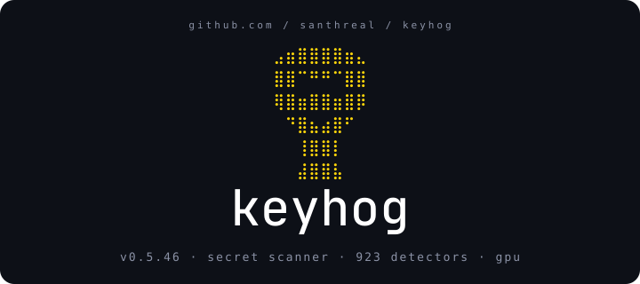
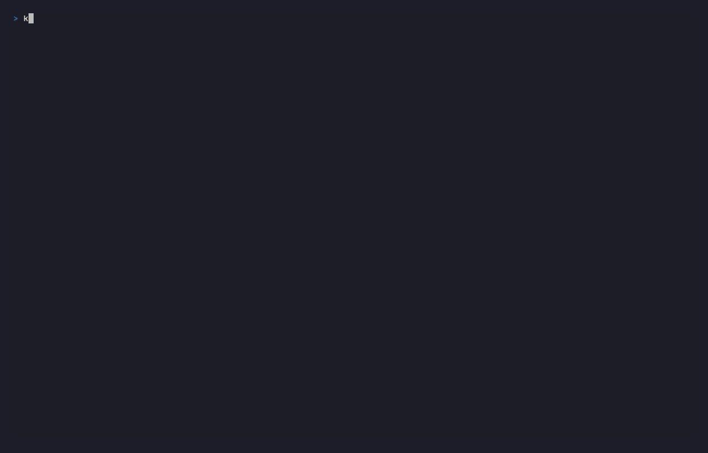
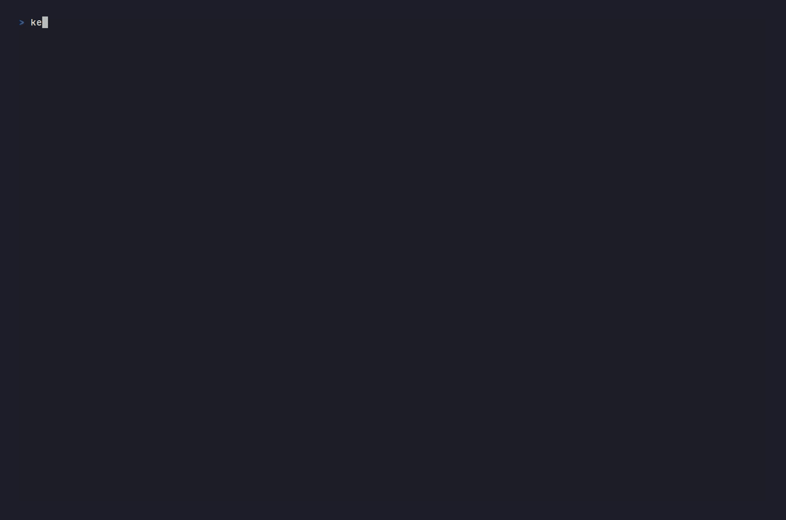
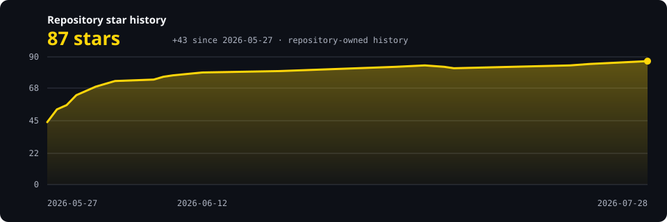

<p align="center">
  
</p>

<p align="center">
  <a href="https://crates.io/crates/keyhog"></a>&nbsp;
  <a href="https://santhreal.github.io/keyhog/"></a>&nbsp;
  <a href="https://github.com/santhreal/keyhog/actions"></a>&nbsp;
  <a href="LICENSE"></a>&nbsp;
  <a href="./metrics/stars.svg"></a>
</p>

<p align="center">
  <strong><a href="https://santh.dev/keyhog/">Website</a></strong> ·
  <strong><a href="https://santhreal.github.io/keyhog/">Documentation</a></strong> ·
  <strong><a href="https://santh.dev/blog/keyhog/">Architecture</a></strong> ·
  <strong><a href="https://github.com/santhreal/vyre">Vyre GPU engine</a></strong>
</p>

# KeyHog: GPU-accelerated secret scanner for code, cloud, and CI

**KeyHog is an open-source secret scanner in Rust that finds and verifies leaked
API keys, tokens, passwords, and credentials across source code, Git history,
containers, cloud storage, browser assets, collaboration content, and running
systems.**

Most secret scanners stop at CPU regex matches in a repository checkout.
KeyHog combines **926 service-specific detectors**, decode-through for concealed
credentials, context-aware confidence and suppression, live provider
verification, and first-class **CUDA, Metal, and WGPU execution through
[Vyre](https://github.com/santhreal/vyre)**. Calibration measures every eligible
pure-Rust CPU, Hyperscan/SIMD, and GPU backend. Automatic routing then uses the
fastest parity-proven route for the exact host and workload class.

| GPU is a real backend | Scan the actual attack surface | Separate signal from noise | Act on the result |
|---|---|---|---|
| CUDA, native Metal, and WGPU are measured peers, not a silent fallback chain. | Scan Git history, Docker layers, archives, cloud buckets, source maps, WASM, HAR captures, hosted Git collections, and whole systems. | Decode base64, hex, URL, protobuf, multiline, and structured configuration before applying confidence, example suppression, and baselines. | Verify eligible credentials with provider APIs, emit SARIF or structured envelopes, and preserve exact coverage and exit semantics. |

```sh
cargo install --locked keyhog
keyhog scan .
```

<p align="center">
  
</p>

## A secret scanner built around the GPU

KeyHog does not hand a few regular expressions to a generic compute shader.
Its GPU path is built on [Vyre](https://github.com/santhreal/vyre), a Rust GPU
compute substrate developed alongside KeyHog. Detector triggers compile into
immutable GPU-resident tables. Bounded source batches produce complete match
positions for the same confirmation, suppression, confidence, and reporting
pipeline used by CPU and Hyperscan routes.

- **Three physical GPU peers.** CUDA, native Metal, and portable WGPU are
  acquired, measured, and reported independently.
- **Exact result parity.** Calibration rejects a candidate whose finding
  identity differs from the reference route. A faster wrong answer never enters
  the routing table.
- **Persistent route evidence.** KeyHog records the binary, detector corpus,
  configuration, workload class, host, accelerator, driver, and measured timing
  evidence. Normal scans do not benchmark in the hot path.
- **Resident execution.** Daemon workers keep compiled detector and accelerator
  state warm for repeated file, archive, history, remote, and cloud batches.
- **No hidden CPU escape hatch.** An explicitly selected accelerator that cannot
  initialize or dispatch fails visibly instead of returning CPU findings under
  a GPU label.

The default crates.io install uses the portable pure-Rust CPU route so it works
on a clean Rust host. Enable the three GPU peers without acquiring Hyperscan:

```sh
cargo install --locked keyhog --no-default-features --features portable,gpu
```

Run the production backend diagnostic, then inspect the measured route:

```sh
keyhog backend --self-test
keyhog calibrate-autoroute --policy all
keyhog backend --autoroute --json
```

The [backend guide](https://santhreal.github.io/keyhog/backends.html) documents
the resident tables, bounded dispatch model, parity contract, and reproducible
crossover evidence.

## Get started

### Install and run your first scan

The two commands above install the latest crates.io release and scan the current
tree with the portable pure-Rust route.

Pin a CI environment to one exact release with
`cargo install --locked --version '=0.5.70' keyhog`. KeyHog requires Rust 1.89
or newer. See the [installation guide](https://santhreal.github.io/keyhog/install.html)
for GPU, Hyperscan, CI, portable, and source-build profiles.

KeyHog exits `0` when the scan is clean and `1` when it reports findings above
your severity floor. Exit `1` means the scanner worked. Review each finding's
file, line, detector, and remediation before deciding whether to remove,
rotate, or suppress the credential. Other nonzero codes describe input,
system, verification, or coverage failures; see the
[exit-code reference](https://santhreal.github.io/keyhog/reference/exit-codes.html).

The complete process contract is:

| Exit | Meaning |
|---|---|
| `0` clean | The scan completed with no reportable finding or coverage failure. |
| `1` findings | Findings are present, but none were confirmed live. |
| `2` operator error | Fix the arguments, configuration, detector corpus, or operator-correctable input. |
| `3` system error | Repair or retry the runner. This includes low-level I/O, fatal daemon service, incremental-cache, and explicitly selected SIMD failures. |
| `4` `backend --self-test` or maintenance failure | The requested installation, repair, backend, or autoroute health check was unhealthy. |
| `10` live credentials | At least one credential was confirmed live. `update --check` also uses this code when a newer release exists. |
| `11` scanner panic | Discard the scan result because scanner state is not trustworthy. |
| `12` required GPU failure | An explicitly selected or required GPU path could not execute. |
| `13` incomplete coverage | A requested source failed or input coverage was incomplete, and no finding outcome took precedence. |
| `130` interrupted | SIGINT or Ctrl-C interrupted the process. |

**Filter, format, gate:**

Create a baseline before using it as a filter:

```sh
keyhog scan . --create-baseline .keyhog-baseline.json
keyhog scan . --baseline .keyhog-baseline.json --format json-envelope --output keyhog.json
```

The first command snapshots reviewed findings and exits `0` without printing
them. Commit that file, then use the second command to report only new finding
identities. A baseline entry matches on the detector and the credential value,
never on the file path, so moving a recorded secret does not fail the gate but
rotating it does. Changed credentials and incomplete coverage remain visible.
The complete path, including monorepo partitions, is [Fail only on new
secrets](https://santhreal.github.io/keyhog/workflows/ci.html#fail-only-on-new-secrets).

For the next scan, use the [recipes
cookbook](https://santhreal.github.io/keyhog/recipes.html) or the copyable
commands in [Choose the right workflow](#choose-the-right-workflow). You can
scan Git history, container images, cloud buckets, repository collections,
URLs, and a whole machine without changing tools.

### Add it to GitHub Actions

Create `.github/workflows/keyhog.yml`:

```yaml
name: keyhog
on:
  push:
    branches: [main]
  pull_request:
permissions:
  contents: read
  security-events: write
jobs:
  scan:
    runs-on: ubuntu-latest
    steps:
      - uses: actions/checkout@3d3c42e5aac5ba805825da76410c181273ba90b1 # v7.0.1
      - uses: santhreal/keyhog@v0
        with:
          path: .
          severity: high
```

The Action scans the checked-out tree, fails on findings at `high` or
`critical`, uploads SARIF to Code Scanning, and retains the report as a workflow
artifact. Installation, coverage, backend, and report-publication failures also
fail the job.

Use the [GitHub Action guide](https://santhreal.github.io/keyhog/workflows/github-action.html)
for inputs, outputs, baseline adoption, monorepo partitions, verification, and
failure behavior. Use the [CI guide](https://santhreal.github.io/keyhog/workflows/ci.html)
for GitLab, CircleCI, Jenkins, Buildkite, and generic shell jobs. Use the
[mass-scanning guide](https://santhreal.github.io/keyhog/guides/mass-scanning.html)
for repository organizations, hosted Git groups, cloud buckets, and partitioned
inventories.

## Scan surfaces other tools treat as separate products

KeyHog scans bytes at the boundary where they can leak, not only tracked source
files. Use one report per boundary so CI retains exact coverage and failure
state.

| Exposure surface | Example |
|---|---|
| Final package artifact | Run `npm pack`, then scan the produced `.tgz` with `keyhog scan package.tgz`. Archive expansion checks generated files, source maps, fixtures, and metadata that are absent from the expected source tree. |
| Deployed browser application | `keyhog scan --url https://app.example.com/assets/app.js` follows bounded JavaScript, source-map, WASM, and response decoding without turning the scanner into an unbounded crawler. |
| GitHub issues, pull requests, discussions, wikis, and gists | `keyhog scan --github-collaboration owner/repo --github-all` scans every collaboration surface outside the checkout. |
| AI agent and MCP configuration | `keyhog scan ~/.config ~/.claude ~/.codex` applies the same detector, decode, confidence, and reporting pipeline to local tool configuration. |
| Container image layers | `keyhog scan --docker-image registry.example.com/team/app:v1` scans the image content that will run, including files introduced during the build. |
| Cloud object inventories | `keyhog scan --s3-bucket BUCKET`, `--gcs-bucket BUCKET`, or `--azure-container-url URL` preserves provider pagination, object, and byte-limit coverage in the terminal report. |
| Entire development host | `sudo keyhog scan-system --space 50G` discovers mounted filesystems and reachable Git history under a hard storage budget. |

These routes share one detection and reporting contract. A source-specific
failure cannot silently turn into a narrower local scan.

## Choose the right workflow

Choose the source boundary first. A preset changes detection work, while a
backend changes execution. Neither one expands a working-tree scan into Git
history, a provider inventory, cloud storage, or a host audit.

There is no honest `scan everything` shortcut. A complete estate review runs
the relevant boundaries below as separate jobs and retains each
`json-envelope` report with its raw exit code.

| Need | Start with | Throughput and reuse | Coverage boundary |
|---|---|---|---|
| Quick local feedback | `keyhog scan . --fast --incremental` | Reuses unchanged-file hashes. The fast preset skips decode, entropy, and ML work. | Run the default policy before merge because fast is intentionally narrower. |
| Full repository scan | `keyhog scan .` | Calibrated `auto` and the CPU-core worker default. Add `--incremental` for repeated scans of the same trusted tree. | Current files only. It does not add Git history. |
| Staged commit gate | `keyhog scan --git-staged` or `keyhog hook install` | Reads exact index blobs, so unstaged edits cannot change the result. | Staged content only. Run a working-tree scan separately when local unstaged bytes matter. |
| GitHub pull-request gate | `santhreal/keyhog@v0` | The Action installs, scans, publishes SARIF and an artifact, then preserves KeyHog's status. | One checked-out path. Use provider inventory scanning for an organization. |
| GitLab, Jenkins, Buildkite, or shell CI | `keyhog scan . --format json-envelope --output keyhog.json` | Persist the report and exit code on success, findings, and errors. Use `--git-diff <base>` only for an explicitly narrower changed-line gate. | The bytes present in the checkout, or the selected diff. |
| Adopt a repository with known findings | Create `.keyhog-baseline.json`, commit it, then scan with `--baseline .keyhog-baseline.json`. | Existing identities remain visible in the baseline while only new findings fail the gate. | A baseline does not suppress changed credentials or incomplete coverage. |
| Recursive Git recovery | `keyhog scan --deep --git-history . --git-blobs . --daemon=off` | Calibrate the deep policy once per worker class. Run in process. | One repository. `--git-history` covers only the current checkout's ancestry, so a branch you never checked out is missed with no coverage gap; `--git-blobs` also reaches dangling blobs, amended-away commits, stashes, notes, annotated tag messages, and packed refs. |
| Container or archive inspection | `keyhog scan --docker-image registry/app:v1` or `keyhog scan incoming/` | Keep an envelope report so skipped, corrupt, encrypted, unsafe, or oversized members remain visible. | Only the selected image or filesystem path and supported nested formats. |
| URL, response, or HAR inspection | `keyhog scan --url https://api.example.com/config` or `keyhog scan capture.har` | Use bounded source limits and preserve the terminal envelope. | Only fetched responses or capture entries. This is not a crawler. |
| Organization or cloud inventory | `keyhog scan --daemon=off --github-org acme --format json-envelope --output acme.json` | Partition by provider, owner, or bucket. Run independent partitions concurrently with one report and status each. | One selected provider inventory per job. Pagination or object limits remain coverage boundaries. |
| Confirm whether eligible findings are live | `keyhog scan . --verify` | Provider concurrency and rate controls are separate from scanner workers. | Sends credential-derived requests to declared provider endpoints. Not every detector supports verification. |
| Whole-host health scan | `sudo keyhog scan-system --space 50G` | Uses all CPU cores by default and scans discovered Git history after filesystem data. | Local mounted filesystems. Network mounts are opt-in and the space ceiling is hard. |
| GPU-backed directory, history, archive, remote, or cloud inventory on Unix | Calibrate autoroute, start `keyhog daemon start --mass`, then run `keyhog scan --daemon=mass <SOURCE>`. | Streams bounded batches through one compiled CPU, Hyperscan, CUDA, Metal, or WGPU worker. The terminal receipt reports exact total and GPU batches, chunks, bytes, GPU share, and throughput. | Baselines, incremental state, verification, lockdown, presets, overlays, and other scanner-policy changes are rejected before acquisition. |

### Scan every supported source boundary

Use one command per boundary. Keep a `json-envelope` report and the raw exit
status for each inventory partition.

| Source or use case | Command |
|---|---|
| Several local roots | `keyhog scan services/api services/web deploy/` |
| Continuously changed files | `keyhog watch services/api deploy/` |
| Staged bytes, changed lines, reachable history, or blobs | `keyhog scan --git-staged`, `--git-diff main`, `--git-history .`, or `--git-blobs .` |
| Native binaries and firmware strings | `keyhog scan --binary firmware.bin` (a plain directory scan skips binaries and still exits `0`) |
| Archives and compressed sources | `keyhog scan incoming/` (supported members expand automatically) |
| Docker image layers | `keyhog scan --docker-image registry/app:v1` |
| JavaScript, source maps, WASM, or an endpoint response | `keyhog scan --url https://api.example.com/config` |
| HTTP request and response captures | `keyhog scan capture.har` |
| GitHub issues, pull requests, discussions, wikis, and gists | `keyhog scan --github-collaboration owner/repo --github-all` |
| GitHub, GitLab, or Bitbucket inventories | `--github-org ORG`, `--gitlab-group GROUP`, or `--bitbucket-workspace WORKSPACE` |
| S3, GCS, or Azure Blob inventories | `--s3-bucket BUCKET`, `--gcs-bucket BUCKET`, or `--azure-container-url URL` |
| A bounded stream from another tool | `producer \| keyhog scan --stdin` (use `set -o pipefail` so a failed producer surfaces its own error, not a zero-byte scan) |

A plain directory scan does not read native binaries. Each one becomes a
`binary (extension or content sniff)` coverage gap, the scan still exits `0`,
and `--no-default-excludes` does not change it, so pass `--binary` when
compiled artifacts are in scope. That flag needs a build with the `binary`
feature, which the default crates.io install has and the lean `ci` feature does
not.

Native binary extraction reports complete credentials that satisfy a named
detector's explicit shape contract. It suppresses short prefix fragments and
generic assignment-shaped strings from compiled data sections because those
bytes do not retain source context.

Endpoint fetching is bounded and SSRF-screened. It is not a crawler. Private
cloud endpoints and credential forwarding require their explicit trust flags.
Provider tokens belong in the documented environment variables, not process
arguments.

Use the [workflow chooser](https://santhreal.github.io/keyhog/capabilities.html)
for source and policy details, the [GitHub Action
guide](https://santhreal.github.io/keyhog/workflows/github-action.html) for the
maintained repository gate, the [direct CI
guide](https://santhreal.github.io/keyhog/workflows/ci.html) for durable reports
and exit handling, and the [mass-scanning
guide](https://santhreal.github.io/keyhog/guides/mass-scanning.html) for
partitioning and aggregation. The [recipes
cookbook](https://santhreal.github.io/keyhog/recipes.html) covers containers,
archives, URLs, GitHub collaboration content, and cloud sources.

### Speed and concurrency without guesswork

Start with the defaults. The historical verified binary-asset installer runs
calibration itself. Cargo cannot execute KeyHog after `cargo install`, so run
the commands below once after installing a multi-backend Cargo build and again
after the host, binary, detector corpus, driver, or workload classes change:

```sh
keyhog calibrate-autoroute --policy all
keyhog backend --autoroute --json
```

| Control | Use it for | Keep this invariant |
|---|---|---|
| Calibrated `--backend auto` | Routine CPU, Hyperscan, or GPU selection. | An explicit backend is a diagnostic override, not a faster default. |
| `--threads <N>` | Reserving CPU capacity on a shared runner. Dedicated hosts should normally leave it unset so KeyHog uses the available cores. | Every value must be positive. Several concurrent KeyHog processes each own a worker pool, so divide the host budget across partitions. |
| `--reader-threads <N>` | Measured storage pipelines where reader work, not scanning, is the bottleneck. | The default derives from the scan worker pool. Leave it unset until profiling shows a reader bottleneck. |
| `--incremental` and `--incremental-cache <PATH>` | Repeated scans of the same trusted tree. | Do not share one index across unrelated repositories or untrusted jobs. |
| Provider or repository partitions | Concurrent estate scanning and independent retries. | Preserve one terminal envelope and raw exit code per partition. Do not concatenate findings and discard coverage state. |
| `--verify-concurrency`, `--verify-rate`, and `--verify-batch` | Bounding live provider checks independently of file scanning. | Verification sends credential-derived requests. Provider rate limits, not CPU count, own this concurrency. |
| Mass daemon | TB-scale directory, history, archive, remote, or cloud streams on one Unix worker. | Each frame is limited to 8 MiB and 1,024 chunks. The daemon serializes fragment state and returns an exact CPU/GPU execution receipt. |
| `--fast`, default, `--deep`, or `--precision` | Selecting an explicit detection-cost and recall policy. | These presets are mutually exclusive and change coverage. They are not interchangeable speed knobs. |

Inspect the resolved policy with `keyhog config --effective`. Use `--profile`
to measure fixed scanner stages and the complete operator run before you change
reader, batch, or channel-depth controls. The low-overhead report records
source, backend, cache, workload, thread, input, state-transition, CPU-time,
peak memory, exact binary SHA-256, enabled-feature SHA-256, target triple, build
profile, compiler, allocator, linked-backend SHA-256, detector-corpus SHA-256,
enabled-detector BLAKE3, compiled-plan BLAKE3, hashed detector-provenance,
complete resolved-configuration BLAKE3, performance-policy BLAKE3, preset,
applied protection state, source adapters, hashed source-target BLAKE3,
hashed source-partition BLAKE3, raw source bytes, source-unit fanout,
decode-derived bytes, completed backend-dispatch bytes, and stable size/fanout
buckets. Byte domains that their source adapter cannot yet distinguish remain
explicitly unavailable instead of becoming measured zeroes. The report does
not record source content, credential values, raw paths, raw URLs, or raw
configuration values. Use `--perf-trace` only for expensive per-pattern and
backend diagnostic counters.
Keep advanced pipeline controls unset unless a reproducible measurement on the
target worker shows an improvement.

For a recurring full repository scan:

```sh
keyhog scan . --incremental \
  --format json-envelope --output keyhog.json
```

For a shared runner where the job is allocated four scanner workers and one
reader worker:

```sh
keyhog scan . --threads 4 --reader-threads 1 \
  --format json-envelope --output keyhog.json
```

The second command is a resource budget, not a universal optimum. Measure the
target host before choosing explicit worker counts.

For [deep recovery](https://santhreal.github.io/keyhog/guides/deep-recovery.html)
and [system-wide triage](https://santhreal.github.io/keyhog/guides/system-wide-triage.html),
use their dedicated guides because their coverage and completion rules differ
from a normal repository scan.

## Secret scanner benchmarks

These panels compare detection policy, CPU and GPU execution requests,
incremental cache behavior, and warm daemon requests. Every value is generated
from the checked benchmark snapshot. The snapshot binds the scanner version,
executable digest, detector digest, corpus, host, and run timestamp. Use the
[full benchmark evidence](#performance) for competitor provenance and
per-category recall.

### Detection accuracy

<!-- BENCH:accuracy:start -->
KeyHog `KeyHog v0.5.63` scanned the **mirror** corpus: 15,000 fixtures, 3,000 labeled positives, and 2,430,321 input bytes. The answer-key manifest was excluded from the scan tree. The row uses the default policy on the explicit Hyperscan/SIMD route on **AMD Ryzen 9 9950X 16-Core Processor**.

| Precision | Recall | F1 | True positives | False positives | False negatives |
|---:|---:|---:|---:|---:|---:|
| 0.9708 | 0.9200 | 0.9447 | 2,760 | 83 | 240 |

The tracked source tree was clean.
<!-- BENCH:accuracy:end -->

### Execution routes, presets, and cache

<!-- BENCH:config:start -->
Measured on **AMD Ryzen 9 9950X 16-Core Processor** with **NVIDIA GeForce RTX 5090**, 32 logical cores, 15,000 fixtures, 3,000 labeled positives, and 2,430,321 input bytes. Scanner: `KeyHog v0.5.63`. The tracked source tree was clean.

#### Full scan by execution route

All rows use the default detection policy with incremental cache and daemon off. The automatic row records the requested policy, but the benchmark result does not bind the selected persisted route, so it is not routing proof. GPU rows include acquisition and full scanner startup on this small corpus; they are not GPU kernel crossover measurements.

| Requested route | Wall | Throughput | Peak RSS | F1 |
|---|---:|---:|---:|---:|
| Hyperscan/SIMD | 929 ms | 2.49 MB/s | 997 MiB | 0.9447 |
| Pure-Rust CPU | 1.03 s | 2.26 MB/s | 893 MiB | 0.9447 |
| CUDA | 2.21 s | 1.05 MB/s | 1517 MiB | 0.9447 |
| WGPU | 2.13 s | 1.09 MB/s | 1403 MiB | 0.9447 |
| Automatic | 1.04 s | 2.23 MB/s | 996 MiB | 0.9447 |

#### Detection policy on Hyperscan/SIMD

The route, cache, daemon state, corpus, and host remain fixed. Presets change detection work, so compare precision and recall as well as time.

| Policy | Wall | Precision | Recall | F1 | Findings |
|---|---:|---:|---:|---:|---:|
| Fast | 774 ms | 0.9733 | 0.9113 | 0.9413 | 2,816 |
| Default | 929 ms | 0.9708 | 0.9200 | 0.9447 | 2,868 |
| Deep | 893 ms | 0.9708 | 0.9207 | 0.9451 | 2,874 |
| Precision | 851 ms | 0.9691 | 0.8057 | 0.8799 | 2,495 |

#### Incremental warm rerun

The benchmark populates the BLAKE3 Merkle index, then times the second identical scan. The small synthetic tree changes little because scanner startup dominates; measure your repository before claiming a speedup.

| Hyperscan/SIMD default policy | Wall | Throughput | Peak RSS |
|---|---:|---:|---:|
| Cache off | 929 ms | 2.49 MB/s | 997 MiB |
| Warm incremental cache | 937 ms | 2.47 MB/s | 1068 MiB |
<!-- BENCH:config:end -->

### Warm daemon requests

<!-- BENCH:daemon:start -->
One deterministic 8 MiB regular file (`sha256:afafbe7b6487fd62866f510e7c281a9e7bfeaa8dc585d7b0478c92ee6c4f5ef5`) was scanned once in process and once through an owned daemon after one warmup request. Daemon time is the client request; daemon RSS belongs to the resident server.

| Explicit route | In process | Warm daemon | Warm / one-shot | In-process RSS | Daemon RSS |
|---|---:|---:|---:|---:|---:|
| Hyperscan/SIMD | 369 ms | 148 ms | 0.40× | 575 MiB | 609 MiB |
| Pure-Rust CPU | 364 ms | 146 ms | 0.40× | 568 MiB | 603 MiB |
| CUDA | 1.39 s | 217 ms | 0.16× | 1189 MiB | 1211 MiB |
| WGPU | 1.32 s | 218 ms | 0.17× | 1110 MiB | 1131 MiB |

The daemon is not a general directory or CI accelerator. It accepts only eligible single-file and bounded-stdin requests on Unix, and it serializes execution.
<!-- BENCH:daemon:end -->
<!-- BENCH:scaling:BEGIN -->
### CPU, reader, storage, size, and partition scaling

Generated by `make -C benchmarks readme-scaling` from `benchmarks/reports/readme-scaling.json`. The harness ran 3 measured trials after 1 warm-up with explicit `simd` and daemon routing off. Worker scaling uses a warm client page cache to isolate CPU work. Reader, corpus-size, storage, and partition rows request clean-page eviction with `posix_fadvise` where the platform supports it; the snapshot records the policy on every row. Every workload is byte-deterministic and finding-free.

Host: `AMD Ryzen 9 9950X 16-Core Processor`, 32 effective logical cores, 94,140 MiB RAM, `Linux 6.17.0-19-generic`. Evidence: `clean`, binary `58bec5eff381`.

#### Scan worker scaling

| Workers | Reader threads | Median wall | p95 wall | Throughput | Speedup | Efficiency | Median peak RSS |
|---:|---:|---:|---:|---:|---:|---:|---:|
| 1 | auto | 7,914.8 ms | 7,929.3 ms | 8.1 MiB/s | 1.00x | 100.0% | 47.3 MiB |
| 2 | auto | 4,160.9 ms | 6,622.6 ms | 15.4 MiB/s | 1.90x | 95.1% | 51.6 MiB |
| 4 | auto | 2,330.4 ms | 6,085.7 ms | 27.5 MiB/s | 3.40x | 84.9% | 57.5 MiB |
| 8 | auto | 1,789.6 ms | 5,650.6 ms | 35.8 MiB/s | 4.42x | 55.3% | 62.6 MiB |
| 16 | auto | 1,407.2 ms | 6,617.4 ms | 45.5 MiB/s | 5.62x | 35.2% | 76.4 MiB |
| 32 | auto | 1,823.7 ms | 5,713.1 ms | 35.1 MiB/s | 4.34x | 13.6% | 126.7 MiB |

#### Filesystem reader scaling

| Scan workers | Reader threads | Median wall | p95 wall | Throughput | Relative to 1 reader | Median peak RSS |
|---:|---:|---:|---:|---:|---:|---:|
| 32 | 1 | 1,888.8 ms | 1,900.6 ms | 33.9 MiB/s | 1.00x | 120.2 MiB |
| 32 | 2 | 1,817.2 ms | 1,818.2 ms | 35.2 MiB/s | 1.04x | 122.5 MiB |
| 32 | 4 | 1,811.7 ms | 1,815.9 ms | 35.3 MiB/s | 1.04x | 125.5 MiB |
| 32 | 8 | 1,819.1 ms | 1,863.5 ms | 35.2 MiB/s | 1.04x | 134.7 MiB |
| 32 | 16 | 1,813.8 ms | 1,823.8 ms | 35.3 MiB/s | 1.04x | 149.5 MiB |
| 32 | 32 | 1,833.0 ms | 1,833.8 ms | 34.9 MiB/s | 1.03x | 179.4 MiB |

#### Corpus-size scaling

| Corpus | Files | Exact bytes | Median wall | p95 wall | Throughput | Median peak RSS |
|---|---:|---:|---:|---:|---:|---:|
| small | 256 | 8 MiB | 839.6 ms | 842.0 ms | 9.5 MiB/s | 112.4 MiB |
| medium | 1,024 | 64 MiB | 1,818.5 ms | 1,823.3 ms | 35.2 MiB/s | 125.7 MiB |
| large | 2,048 | 256 MiB | 5,125.5 ms | 5,166.5 ms | 49.9 MiB/s | 138.0 MiB |

#### Storage scaling

| Storage class | Filesystem | Device ID | Median wall | p95 wall | Throughput | Relative to first storage | Median peak RSS |
|---|---|---:|---:|---:|---:|---:|---:|
| workspace | `ext4` | `66305` | 1,822.2 ms | 1,829.9 ms | 35.1 MiB/s | 1.00x | 125.8 MiB |
| local-temp | `tmpfs` | `116` | 1,786.5 ms | 1,806.1 ms | 35.8 MiB/s | 1.02x | 125.0 MiB |

#### Concurrent partition scaling

| Processes | Workers per process | Aggregate workers | Total files | Total bytes | Median wall | Aggregate throughput | Speedup | Median summed peak RSS |
|---:|---:|---:|---:|---:|---:|---:|---:|---:|
| 1 | 32 | 32 | 256 | 8 MiB | 848.5 ms | 9.4 MiB/s | 1.00x | 111.8 MiB |
| 2 | 16 | 32 | 512 | 16 MiB | 385.6 ms | 41.5 MiB/s | 4.40x | 133.1 MiB |
| 4 | 8 | 32 | 1,024 | 32 MiB | 548.2 ms | 58.4 MiB/s | 6.19x | 224.5 MiB |

These rows are measurements, not universal tuning constants. Run the generator on the target host and storage. Use the knee where throughput stops improving, then reserve CPU and memory for the CI runner or orchestration layer.
<!-- BENCH:scaling:END -->

Reproduce all four benchmark groups with `make -C benchmarks readme-matrix`.
The command measures the required matrix and fails if any requested CPU,
Hyperscan, CUDA, Metal, WGPU, preset, cache, daemon, thread, reader, storage, corpus
size, or partition row is unavailable. Use
`make -C benchmarks readme-matrix-check` to verify that both snapshots, reports,
and README agree.

### Choose a scan configuration

Start with the default policy and calibrated automatic routing. Change one axis
only when the workflow requires it:

| Workflow | Detection policy | Execution and reuse | Additional control |
|---|---|---|---|
| First repository scan | Default | Calibrated `auto`; `--daemon=auto` | Review all findings before adding suppressions. |
| Repeated local tree or CI scan | Default | Calibrated `auto`; `--incremental` | Persist the incremental cache only between scans of the same trusted tree. |
| Short feedback loop | `--fast` | Calibrated `auto`; optional `--incremental` | Accept reduced decode, entropy, and ML coverage. Run the default policy before merge. |
| Highest-recall recovery | `--deep` | In process | Deep is mutually exclusive with fast and precision, and is not daemon eligible. |
| Lower-noise large inventory | `--precision` | In process for repository collections, history, and cloud sources | The preset raises confidence floors and disables entropy discovery. It can miss lower-confidence credentials. |
| TB-scale directory, history, archive, remote, or cloud inventory on Unix | Default | `keyhog daemon start --mass`, then `--daemon=mass` | Batches stay bounded at 8 MiB and 1,024 chunks. Preserve the terminal coverage report and GPU execution receipt. |
| Live credential validation | Default | In process | Add `--verify` explicitly. Verification sends credential-derived requests to providers. |
| Linux no-swap scan | Default plus `--lockdown` | In process; incremental cache disabled | Lockdown refuses verification, plaintext secrets, fast mode, and completeness-reducing switches. |

`--fast`, `--deep`, and `--precision` are mutually exclusive detection presets.
`--lockdown` is a fail-closed execution mode, not a fourth preset. Explicit
`--backend` values are diagnostics and benchmark overrides. They do not replace
the persisted fastest-correct evidence used by automatic routing. See
[Configuration](https://santhreal.github.io/keyhog/reference/configuration.html),
[autoroute calibration](https://santhreal.github.io/keyhog/reference/autoroute-calibration.html),
[daemon and warm scans](https://santhreal.github.io/keyhog/workflows/daemon.html),
and [hardening](https://santhreal.github.io/keyhog/hardening.html) for the full
contracts.

## How KeyHog works

KeyHog compiles its 926 detectors into a shared trigger/extraction plan,
uses Hyperscan when that feature is present, decodes nested encodings before
matching, and can apply explicit per-detector Bayesian Beta(α,β) confidence
calibration. Hardware acceleration is an explicit backend selection layer;
every selected backend must preserve the same detector ids and findings
contract:

| Layer / Backend | When | How |
|---|---|---|
| `simdsieve` prefilter | AVX-512 / AVX2 / NEON | Layer 1: skims every file for 12 high-value literal prefixes in one SIMD pass: AWS `AKIA`/`ASIA`, GitHub `ghp_`, OpenAI `sk-proj-`, Slack `xoxb-`/`xoxp-`, SendGrid `SG.`, Square `sq0csp-`, and Stripe `sk_live_`/`sk_test_`/`rk_live_`/`rk_test_` |
| `gpu-cuda-region-presence` | executable CUDA peer + persisted calibration proof | VYRE literal-set region-presence through CUDA, followed by the shared CPU validation tail |
| `gpu-metal-region-presence` | executable native Metal peer + persisted calibration proof | VYRE literal-set region-presence through Metal, followed by the shared CPU validation tail |
| `gpu-wgpu-region-presence` | executable WGPU peer + persisted calibration proof | VYRE literal-set region-presence through WGPU, followed by the shared CPU validation tail |
| `simd-regex` | Hyperscan compiled and live | parallel Hyperscan trigger scan plus full-regex extraction; portable builds do not expose this backend and report `cpu-fallback` instead |
| `cpu-fallback` | portable build or explicit CPU selection | Aho-Corasick prefix + Rust `regex` extraction |

### Autoroute

KeyHog autoroute measures every eligible backend with phase-two localization on
and off, then persists the fastest parity-checked route for the exact binary,
host, resolved policy, and workload class. It is not a hardware heuristic or
fallback hierarchy. A missing, stale, invalid, or quarantined decision is never
called autoroute: KeyHog warns, scans every byte through the scalar correctness
oracle, and reports `complete_after_recovery` with the recalibration command.

Install performs the visible calibration. To recalibrate an installed binary,
run `keyhog calibrate-autoroute`; inspect evidence with
`keyhog backend --autoroute`. Explicit `--backend` values are diagnostic and
benchmark overrides, not autoroute proof. Single-backend portable builds do
not need a routing cache.

If an automatically selected accelerated backend faults, KeyHog warns and
replays the same stable input through the fastest remaining measured-correct
peer. GPU recovery retains completed shards and scans only exact unprocessed
ranges. KeyHog reports `complete_after_recovery`. The affected workload route is
quarantined in a bounded runtime-health artifact separate from calibration
timings, so a restart cannot retry it. Successful recalibration clears only the
repaired workload identities. Explicit or required backends remain hard
contracts and are never substituted.

The complete parity contract, workload identity, GPU/Hyperscan behavior, daemon
semantics, cache lifecycle, and troubleshooting matrix live in the
[autoroute reference](docs/src/reference/autoroute-calibration.md).

**Full documentation:** [santhreal.github.io/keyhog](https://santhreal.github.io/keyhog/) - install, first scan, output formats, detection internals, suppressions, verification, pre-commit + CI integration, CLI reference, autoroute, exit codes, env vars, and contributing. Source under `docs/`.

---

## Install KeyHog

Install the current crates.io release:

```sh
cargo install keyhog --locked
```

Build the repository checkout when you need an unreleased change:

```sh
cargo install --path crates/cli --locked
```

Confirm the installed build:

```sh
keyhog --version --full
keyhog doctor
```

Use the [install guide](https://santhreal.github.io/keyhog/install.html) for
Rust toolchain requirements, feature profiles, and platform-specific runtime
dependencies.


## What it catches

926 embedded detectors with detector-owned offline validation and companions:

- **Cloud providers:** AWS (access key + secret + STS verification),
  Azure (subscription key, storage account key, SAS), GCP (service account,
  API key), Cloudflare, Heroku, Vercel, Supabase.
- **Payment processors:** Stripe, Braintree, Razorpay, Paddle, Plaid,
  Square, and PayPal, with detector-owned checks and optional or required
  companions. A Razorpay key secret requires its nearby key ID.
- **Source forges:** GitHub PATs (with CRC32 checksum), GitLab tokens,
  Bitbucket app passwords, npm tokens (with checksum), Gitea / Forgejo
  / Codeberg.
- **Auth / SSO:** Okta, Auth0, Clerk, JumpCloud, Kinde.
- **Comms:** Slack, Discord, Twilio, SendGrid, Postmark, Mailgun,
  Resend, Loops.
- **AI / ML:** OpenAI (sk-/sk-proj-), Anthropic, Google AI Studio,
  Cohere, Mistral, HuggingFace, Replicate. HuggingFace organization
  credentials include both the current `hf_` form and legacy `api_org_`
  tokens.
- **Password managers:** 1Password account secret keys (`A3-` followed by
  five or six segmented uppercase alpha-numeric components).
- **Databases:** Postgres connection strings, MongoDB Atlas, Supabase
  service-role, PlanetScale, Neon, Turso, MySQL, Redis URLs.
- **Generic + entropy discovery:** `API_KEY=<high-entropy-blob>` catches
  credentials with no named detector, gated by per-context entropy
  thresholds + ML scoring.
- **Cryptographic material:** RSA / EC / SSH private keys, PGP private
  blocks, JWT signing secrets.

Each detector ships as a [TOML file](./detectors/) (data, not code):
service metadata, regex patterns, keywords, offline validators, entropy and ML
policy, companion fields, and verification handler. Adding a new detector is a
single reviewable TOML change;
the [contributor guide](./CONTRIBUTING.md) walks through it.

`keyhog explain <id>` dumps any detector's full spec: patterns, keywords,
verification endpoint, plus a service-keyed rotation and step-by-step
remediation guide, so a finding is never a black box:

<p align="center">
  
</p>

Browse detector authoring and inspection in the
[detector reference](docs/src/detectors.md), or query the installed corpus with
`keyhog detectors --search <term> --verbose`.

## Why higher recall, fewer false positives

- **Decode-through scanning.** Kubernetes `Secret` manifests, Jupyter
  notebooks, JWT payloads, base64-wrapped envs, Helm values, and docker-config
  `auth:` blobs. The structured preprocessor treats balanced Helm actions as
  inert render-time values and closes missing Jupyter delimiters at end of file,
  so literal bytes and complete code cells remain covered. It decodes structured
  values in place and feeds every downstream detector the plaintext. Detectors
  do not each need to re-implement decoding. Decode-enabled scans also recover
  side-effect-free JavaScript byte-array XOR and AES-256-CBC expressions when
  all recovery material is embedded, including strict CryptoJS/OpenSSL salted
  passphrase wrappers. KeyHog never executes the source.
- **Multiline reassembly.** `"sk-proj-" + \` continuation in JavaScript,
  YAML multi-line strings, Makefile backslash-continuation, Helm /
  Jinja templated outputs, all reassembled before regex matching.
- **Companion validation.** Required companions gate high-noise detectors. A
  Twilio API key without its API secret is skipped. Optional companions enrich
  confidence or verification. AWS access-key detection does not require its
  secret, but the secret is needed for live verification.
- **Cross-detector resolution.** Detector TOML can require, reject, or subsume
  bounded findings from another detector. Resolution stays deterministic across
  input order, and invalid targets, contradictions, or dependency cycles fail
  corpus compilation.
- **Confidence scoring.** Every finding carries a `[0.0, 1.0]` score
  derived from Shannon entropy, surrounding context, companion match,
  detector-owned offline proof (GitHub/npm CRC32 and PyPI payload decoding),
  structural evidence, and a small ML classifier
  (~30k params). Default threshold `0.40` (the canonical
  `ScanConfig::default()` floor; same as the `--min-confidence` default
  and the `[scan].min_confidence` example below) filters low-quality
  matches without hiding real secrets.
- **Bayesian per-detector calibration.** `keyhog calibrate --fp generic-api-key`
  writes a Beta(α,β) posterior. Scans use it only when `--calibration-cache`
  or `[system].calibration_cache` points at that file, so confidence tuning is
  explicit and reproducible instead of depending on stray host cache state.

## Performance

Use the reproducible harness in [`benchmarks/`](benchmarks/) to compare KeyHog,
Betterleaks, Kingfisher, TruffleHog, and Titus under one scoring contract. The
harness excludes the ground-truth manifest from every scan tree. The generated
tables remain empty until current-schema runs exist. Run
`make -C benchmarks report` after measurement. Do not edit generated tables by
hand.

### Detection leaderboard

<!-- BENCH:leaderboard:start -->
Corpus: **mirror** - 15000 fixtures, 3000 labeled positives. Every scanner scored identically (SecretBench overlap rule); the answer-key manifest is excluded from the scan tree.

| Rank | Scanner | F1 | Precision | Recall | Findings | Wall | Peak RSS |
|---|---|---|---|---|---|---|---|
| 1 | **KeyHog** | **0.9328** | 0.9651 | 0.9027 | 2816 | 0.83s | 418 MB |
| 2 | Kingfisher | 0.4683 | 0.3877 | 0.5913 | 5255 | 4.47s | 421 MB |
| 3 | Betterleaks | 0.3498 | 0.2241 | 0.7970 | 11113 | 0.67s | 198 MB |

### Result provenance

| Scanner | Scanner version / executable digest | Corpus identity | Host identity | Run date |
|---|---|---|---|---|
| KeyHog | version: KeyHog v0.5.69<br>Commit: f870641d2b40210457c81ee3441cc1cfef8b4b06<br>Detector Set: 926 (926-4168e2c6c93a16ca)<br>Build Target: x86_64-linux<br>ML Model Version: moe-v1-246a05b92bec9aa3<br>ML Model Card: recorded 2026-07-15; features 55; synthetic F1 0.971 / P 0.945 / R 0.999; real F1 0.832 / P 0.753 / R 0.931 / recall@0.40 0.938; zero-recall detectors 2/32; six-scanner differential unavailable<br>executable SHA-256: `78ae0cb540e450aecefdfde8d5aff988c3ae1b73cff7a6748f0d640a67a02fcc` | mirror; 15,000 fixtures; 3,000 labeled positives; 2,431,242 bytes | hostname SHA-256/12: `82fcd9288623`<br>Linux 6.17.0-19-generic<br>AMD Ryzen 9 9950X 16-Core Processor | 2026-08-10T12:51:17Z |
| Kingfisher | version: kingfisher 1.94.0<br>executable SHA-256: `a49f8e9838d7f1da1e9f328a4dbc45a16996bce5078cde3ff1b8ad422d8ab07a` | mirror; 15,000 fixtures; 3,000 labeled positives; 2,431,242 bytes | hostname SHA-256/12: `82fcd9288623`<br>Linux 6.17.0-19-generic<br>AMD Ryzen 9 9950X 16-Core Processor | 2026-08-10T12:51:26Z |
| Betterleaks | version: betterleaks version dev<br>executable SHA-256: `466f7d34e1ebcf12ecd5939494f509c17125e54416226976fced2f046da56ba4` | mirror; 15,000 fixtures; 3,000 labeled positives; 2,431,242 bytes | hostname SHA-256/12: `82fcd9288623`<br>Linux 6.17.0-19-generic<br>AMD Ryzen 9 9950X 16-Core Processor | 2026-08-10T12:51:20Z |
<!-- BENCH:leaderboard:end -->

### Speed & memory

<!-- BENCH:perf:start -->
| Scanner | Config | Corpus | Wall | Throughput | Peak RSS |
|---|---|---|---|---|---|
| Betterleaks | `default-nocache-nodaemon-no-validate` | mirror | 0.67s | 3.5 MB/s | 198 MB |
| KeyHog | `simd-nocache-nodaemon-full` | mirror | 0.83s | 2.8 MB/s | 418 MB |
| Kingfisher | `default-nocache-nodaemon-low-no-validate` | mirror | 4.47s | 0.5 MB/s | 421 MB |
<!-- BENCH:perf:end -->

### Per-category recall comparison

<!-- BENCH:gaps:start -->
_Diagnostic recall slice only. Overall precision and F1 remain the comparison contract; false positives are counted in their scored categories._

| Category | KeyHog P/R/F1 | KeyHog TP/FN | Best competitor P/R/F1 | Recall gap |
|---|---|---|---|---|
| `generic-high-entropy-string` | 1.000 / 0.434 / 0.606 | 73/95 | Betterleaks 1.000 / 0.798 / 0.887 | +0.363 |
<!-- BENCH:gaps:end -->

### Bounded static recovery telemetry

<!-- BENCH:recovery:start -->
Selected run: scanner **KeyHog** `KeyHog v0.5.69<br>Commit: f870641d2b40210457c81ee3441cc1cfef8b4b06<br>Detector Set: 926 (926-4168e2c6c93a16ca)<br>Build Target: x86_64-linux<br>ML Model Version: moe-v1-246a05b92bec9aa3<br>ML Model Card: recorded 2026-07-15; features 55; synthetic F1 0.971 / P 0.945 / R 0.999; real F1 0.832 / P 0.753 / R 0.931 / recall@0.40 0.938; zero-recall detectors 2/32; six-scanner differential unavailable`; corpus **mirror** (15,000 fixtures, 2,431,242 bytes); generated `2026-08-10T12:51:17Z`; artifact `mirror-keyhog-simd-nocache-nodaemon-full.json`.

Telemetry schema: `static-recovery-v1`.

| Disposition | Exact count |
|---|---:|
| Supported | 0 |
| Unsupported | 0 |
| Erroneous | 0 |

| Rejection reason | Exact count |
|---|---:|
| _none_ | 0 |
<!-- BENCH:recovery:end -->

### Bigram Bloom evidence

<!-- BENCH:bloom:start -->
_Bloom corpus evidence was not recorded for the selected artifact. Run `make bloom KEYHOG_BIN=/absolute/path/to/keyhog` and attach the result; no synthetic or zero-valued fallback is inferred._
<!-- BENCH:bloom:end -->

Reproduce: `make -C benchmarks canonical KEYHOG_BIN=/absolute/path/to/keyhog`
reruns the exact KeyHog, Betterleaks, and Kingfisher mirror run set, including
the executable-bound CredData Bloom differential, into `benchmarks/results/`;
`make -C benchmarks report` regenerates the tables above and
`benchmarks/reports/`. See [`benchmarks/README.md`](benchmarks/README.md)
for the corpora (mirror, competitor home-turf, Samsung/CredData) and the
backend/cache/daemon/OS/GPU matrix.

## GPU-backed mass daemon workers

The optional Unix mass daemon keeps one compiled scanner and its calibrated
CPU, Hyperscan, CUDA, Metal, or WGPU backend state warm. Local filesystem scans send
only canonical root and source-policy metadata; the daemon reads and batches
those bytes in its own process. Git, binary, remote, and cloud sources that
require client-side credentials still use protected bounded chunk frames:

```sh
# Calibrate on this worker class, then run the service in the foreground
# or under a service manager.
keyhog calibrate-autoroute --policy default
keyhog daemon start --mass

# Stream one independently retryable inventory partition.
keyhog scan --daemon=mass /srv/inventory/team-a \
  --format json-envelope --output team-a.json
keyhog daemon status
keyhog daemon stop
```

Daemon-local filesystem batches and protected wire batches each carry at most
8 MiB of raw payload and 1,024 chunks. Input size does not determine resident
batch memory, so the same route can process a TB-scale tree without collecting
it in RAM. Local file payload bytes never cross the IPC socket. The daemon holds
an exclusive fragment-state lease for the transaction and clears that state
when the client finishes, disconnects, or fails.

For protected wire batches, the client validates the completion receipt against
the exact chunks and bytes it sent. For daemon-local paths, the daemon receipt
is the source-byte authority. Stderr reports the transport, total and GPU
batches, chunks, bytes, GPU byte share, whether GPU processed more than half of
all bytes, and daemon-side throughput. Invalid receipt invariants fail instead
of emitting a scan report. Acquisition gaps remain visible in the envelope and
use exit `13`.

Routine workers use persisted autoroute evidence. Add `--mass-gpu-primary` at
daemon startup when a TB-scale worker must prove that GPU processed more than
half of all non-empty payload bytes. The client fails before reporting when the
terminal receipt is CPU-majority. To diagnose a GPU-only worker, force
`--backend gpu-cuda-region-presence` or `--backend
gpu-wgpu-region-presence`. A forced GPU service exits `12` when GPU startup
fails and returns an error instead of substituting CPU after a runtime fault.
An explicit backend remains a diagnostic override, not autoroute proof.

`--daemon=mass` is an explicit required route. It never falls back to an
in-process scan. Baseline state, incremental state, live verification,
lockdown, presets, detector overlays, custom allowlists, and scanner-policy
overrides remain in-process contracts and are rejected before source
acquisition. Warm one-file and stdin requests remain available on the same
socket through `--daemon=on`.

See
[daemon and warm scans](https://santhreal.github.io/keyhog/workflows/daemon.html)
and [mass scanning](https://santhreal.github.io/keyhog/guides/mass-scanning.html).

## System-wide credential triage

```sh
sudo keyhog scan-system --space 50G
sudo keyhog scan-system --include-network --output system-findings.json
```

`scan-system` is a bounded local-host audit, not a replacement for repository or
cloud inventory partitioning. It bounds itself by total bytes scanned rather
than by path: `--space` is the ceiling, and network-mounted filesystems are
skipped unless you pass `--include-network`. Review mount, network-filesystem,
space-ceiling, and privilege behavior before running it. See
[system-wide triage](https://santhreal.github.io/keyhog/guides/system-wide-triage.html).

## Lock down sensitive local scans

Linux `--lockdown` is a fail-closed process-protection mode:

```sh
keyhog scan . --daemon=off --lockdown
```

It locks current and future memory, disables core dumps and the incremental
cache, remains in process, and refuses verification, plaintext output, fast
mode, and completeness-reducing switches. It fails on unsupported platforms or
insufficient locked-memory capacity. See
[hardening and data handling](https://santhreal.github.io/keyhog/hardening.html).

## Use KeyHog as a Rust library

```rust
use keyhog_core::{Chunk, ChunkMetadata, RawMatch};
use keyhog_scanner::CompiledScanner;

let detectors = keyhog_core::load_embedded_detectors_or_fail()?;
let scanner = CompiledScanner::compile(detectors)?;
let findings = scanner.scan(&Chunk {
    data: "TOKEN=sk_live_EXAMPLE…".into(),
    metadata: ChunkMetadata::default(),
})?;
let report_safe: Vec<_> = findings.iter().map(RawMatch::to_redacted).collect();
```

The default library methods are deterministic portable CPU references. Explicit
backend methods return typed errors instead of terminating the process or
silently substituting another engine. Raw chunks and matches can contain
plaintext. Convert them with `RawMatch::to_redacted`, or use final
`VerifiedFinding` values, before JSON, logs, disk, or network boundaries.

The [architecture guide](docs/src/architecture.md) defines crate ownership,
backend contracts, recovery receipts, source helpers, and safe reporting
boundaries. Crate-level Rust documentation owns the complete API.

## Configure policy with explicit precedence

Repository policy lives in `.keyhog.toml`:

```toml
verify = false

[scan]
severity = "high"
incremental = true

[system]
gpu = "auto"
```

Resolution order is built-in defaults, user configuration, repository
configuration, environment where documented, then explicit CLI overrides.
Unknown keys and invalid combinations fail before scanning. Run
`keyhog config --effective` to inspect the resolved policy without exposing
proxy credentials.
Entries past `expires` fail allowlist load before scanning.

See [configuration and precedence](https://santhreal.github.io/keyhog/reference/configuration.html)
for every key and [environment variables](https://santhreal.github.io/keyhog/reference/env.html)
for credential and runtime inputs.

## Architecture

KeyHog keeps orchestration at the edge and domain behavior in libraries:

```text
sources -> scanner -> suppression/confidence -> reporting
                 \-> optional verifier
CLI and Action own process, transport, and exit semantics.
```

Detector definitions remain data under `detectors/`. `keyhog-core` owns
detector and finding types, `keyhog-scanner` owns matching and execution
backends, `keyhog-sources` owns input acquisition, `keyhog-verifier` owns live
checks, and `keyhog-cli` owns operator workflows.

Start with the [architecture guide](docs/src/architecture.md) for the repository
map, dependency direction, bytes-to-finding pipeline, routing ownership, and
profiling entrypoints.

## Inspect and extend the installation

```sh
keyhog detectors --search aws --verbose
keyhog explain aws-access-key
keyhog backend --autoroute --json
keyhog completion zsh
```

The [CLI reference](https://santhreal.github.io/keyhog/reference/cli.html)
lists every command, flag, generated default, and exit status. Use
`keyhog --help` and `keyhog <command> --help` for the exact installed version.

## Contributing

- **New detector?** Drop a TOML in [`detectors/`](./detectors/), open a
  PR. The contributor guide ([`CONTRIBUTING.md`](./CONTRIBUTING.md))
  has the schema and a worked example.
- **Bug / missed secret / false positive?** File an issue with the
  redacted credential shape and detector id; each report becomes a
  permanent test fixture under
  [`crates/scanner/tests/contracts/`](./crates/scanner/tests/contracts/).
- **Release behavior?** Every successful `main` CI run increments the patch
  version, generates changelogs, and publishes all six crates to crates.io.
  Add an optional fragment under [`changes/`](./changes/) for a precise note.
  The [release guide](https://santhreal.github.io/keyhog/releasing.html) covers
  the automatic transaction and failed-upload recovery.
- **Security issue in KeyHog itself?** Don't open a public issue;
  use [GitHub private vulnerability reporting](https://github.com/santhreal/keyhog/security/advisories/new).
  If that form is unavailable, email `security@santh.dev`; PGP is not required.

[Changelog](./CHANGELOG.md). [Open issues](https://github.com/santhreal/keyhog/issues).

## Credits

KeyHog stands on prior secret-scanning work. Ideas borrowed from:

- [TruffleHog](https://github.com/trufflesecurity/trufflehog): detector breadth and verification semantics
- [Betterleaks](https://github.com/betterleaks/betterleaks): token-efficiency and false-positive suppression
- **Titus:** scanning ergonomics and severity calibration

Thanks to these projects and their contributors.

## License

License: MIT OR Apache-2.0.

Terms: [MIT](./LICENSE-MIT) and [Apache-2.0](./LICENSE-APACHE). This dual license covers the code and
detector TOMLs. Commercial use, embedding, forks, and hosted services are
permitted under either license.

---

## Star history

<p align="center">
  <a href="./metrics/stars.json"></a>
</p>

<p align="center">
  <sub>Generated from <a href="./metrics/stars.json">UTC observations of GitHub's public star count</a>. The repository stores the first point and each later count transition. Same-day reruns replace that day's point, and unchanged counts create no commit.</sub>
</p>
